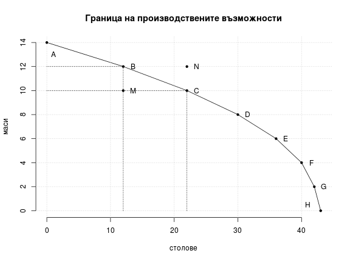
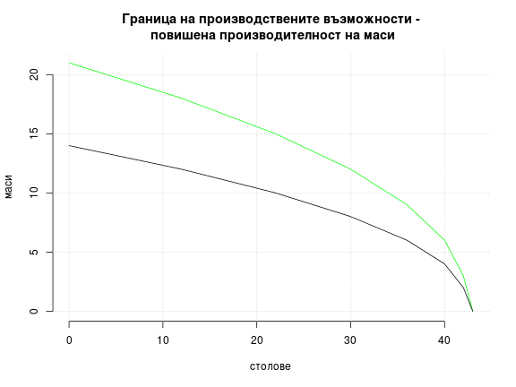
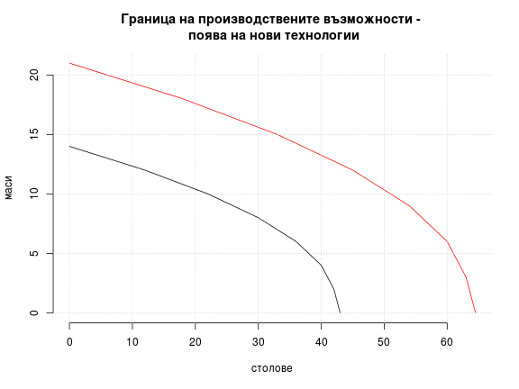

# Лекция 1. Същност на икономическата наука

## 1. Обект и клонове на икономическата наука

Обект на икономическата наука е икономическата система. Икономическата система представлява „съвкупност от взаимнообуславящи се производствени процеси, а всеки производствен процес - като въздействие от страна на човека върху природни вещи и процеси, което ги превръща в потребителни стойности“. Икономическата система може да бъде обект на изучаване и от други науки. Икономиката поставя акцента върху отношенията между производствените процеси, чрез които се изразяват отношения между хора, действащи като субекти на икономическата дейност с определено поведение и интереси.

* Клоновете на икономическата наука могат да се обособят в четири големи групи:
  * Първата група изучава икономиката на различни нейни равнища (напр. общата икономическа теория);
  * Втората група включва функционалните икономически науки, които пронизват всички равнища (счетоводство, финанси, икономика на труда и др.);
  * Третата група са конкретни, изучаващи отраслите в икономиката (напр. икономика на туризма);
  * Четвъртата група включва исторически икономически дисциплини като стопанска история.

## 2. Определение и функции на общата икономическа теория

* Предмет на общата икономическата теория - начина на развитие на отделните общества и как те използват ограничените ресурси, с които разполагат;
  * Понятието оскъдност е ключово за цялата икономическа наука. Недостигът означава невъзможността на наличните ресурси да задоволят изцяло нащите нужди и желания;
  * Лайнъл Робинс: _„Икономическата наука изследва човешкото поведение като взаимоотношение между целите и оскъдните средства, които имат алтернативна употреба“_;
* Основни функции на икономическата теория - познавателна, практическа и методологическа

## 3. Методи и проблеми при изучаване на икономическата система

* Методи
  * Абстрактно-логически (дедукция и индукция)
  * Сравнителен метод
  * Статистически методи
  * Математически методи
* Проблеми
  * Хората са непостоянни
  * Икономистите невинаги са обективни и безпристрастни
  * Трудно се провеждат контролирани експерименти
  * Понякога не е възможно да се правят точни измервания
* Използват се опростени схеми или модели. Имат отношение към частни зависимости.
  * „ceteris paribus“ - при равни други условия
* Теория - обозначава по-общи и цялостни възгледи за икономическите зависимости

## 4. Микроикономика и макроикономика

* Микроикономиката е икономическият анализ на поведението на микроединицте в икономическата система - домакинствата и фирмите. Този раздел се занимава с изследване на три основни въпроса - потребителското търсене, производствените решения, ценообразуването и пазарното поведение;
* Макроикономиката се интересува от националното стопанство като цяло. Тя изследва микроединиците в тяхната обвързаност.

## 5. Позитивна и нормативна теория

* Позитивната икономическа теория се занимава с това, което е било, което е или което ще бъде. Позитивните твърдения изтъкват факти;
* Нормативната икономическа теория се занимава с това, което трябва да бъде.

## 6. Еволюция на икономическата теория

* Меркантилизъм
* Класическа школа
* Марксистка политическа икономия
* Неокласическа икономическа теория
* Кейнсианска икономическа теория
* Неолиберализъм

# Лекция 2. Основни проблеми на икономиката

## 1. Оскъдността, потребностите и основните икономически проблеми

Оскъдността е причината за възникването на основните проблеми, които си поставя за цел да реши икономиката. Тя е обусловена от ограничеността на ресурсите, но в същото време е относително понятие - проявява се на фона на нуждите и желанията на хората. Обикновено желанията на хората отиват отвъд възможностите да бъдат задоволени. В контекста на материалната организация на обществото това води до въпросите “Какво”, “Как” и “За кого” да се произвежда - трите основни проблема пред всяка икономическа система.

## 2. Проблемът „Какво да се произвежда?“

Тъй като с наличните ресурси не можем да произведем всичко, което желаем, трябва да направим избор. Което означава, че произвеждайки дадено благо, се отказваме от производството на друго. Това намира отражение в понятието _алтернативна цена_. Алтернативната цена е цената на пропуснатата възможност. Има се предвид втората най-добра възможност за употреба на ресурсите (в случай, че съществуват повече от два варианта за тяхната употреба).

## 3. Проблемът „Как да се произвежда?“

Въпросът “Какво да се произвежда” е свързан с въпроса “Как да се произвежда”. Ограничеността на ресурсите налага да се използват онези начини за производство, при които от наличните ресурси се произвежда максимално количество продукция. Което означава да се произвежда ефективно (това е т.нар. “техническа ефективност”), защото при равни други условия това ще позволи създаването на повече блага. Границата на производствените възможности илюстрира едновременно цената на избора (алтернативната цена) и ефективността. В случая се има предвид производствена ефективност не от технически, а от икономически аспект. Точките на производство, които се намират под границата, позволяват то да бъде увеличено едновременно и за двете блага. Ако се намираме на самата граница, за да увеличим производството на единия продукт, трябва да намалим производството на другия. Когато е налице таква изходна позиция, казваме, че е налице производствена ефективност. 

##### Граница на производствените възможности

|    | A | B | C | D | E | F | G | H 
-----|---|---|---|---|---|---|---|---
столове|0|12|22|30|36|40|42|43
маси|14|12|10|8|6|4|2|0

 

 

 

##### Алтернативната цена и сравнителните предимства

* Абсолютни предимства

|   | Вино | Вълна 
----|------|------
Англия | 10 л/час | 15 кг/час
Португалия | 20 л/час | 10 кг/час

* Сравнителни предимства
   
|   | Вино | Вълна 
----|------|------
Англия | 10 л/час | 15 кг/час
Португалия | 20 л/час | 20 кг/час

## 4. Проблемът „За кого да се произвежда?“

Този проблем е свързан с начина, по който се разпределят благата. Това може да се осъществява според приноса в създаването им, според нуждите или по равно за всички. 

## 5. Трите основни проблема в тяхното единство

Оптималният отговор на трите въпроса е този, при който се достига до производствена (производството се осъществява при най-ниски разходи), разпределителна (ограничените ресурси се разпределят за производството на необходимите и желани от обществото блага) и дистрибутивна (при наличния си доход, предпочитания и пазарни цени хората не биха разпределеили разходите си по друг начин) ефективност.

Според това какви отговори дават на основните въпроси, икономическите системи биват два основни вида - пазарна система и административно-планова система.
