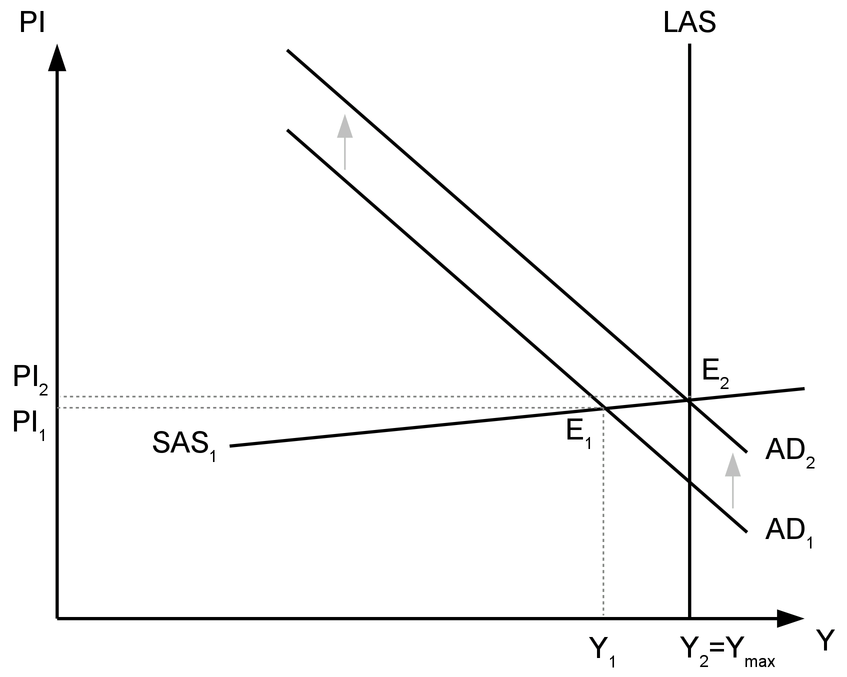
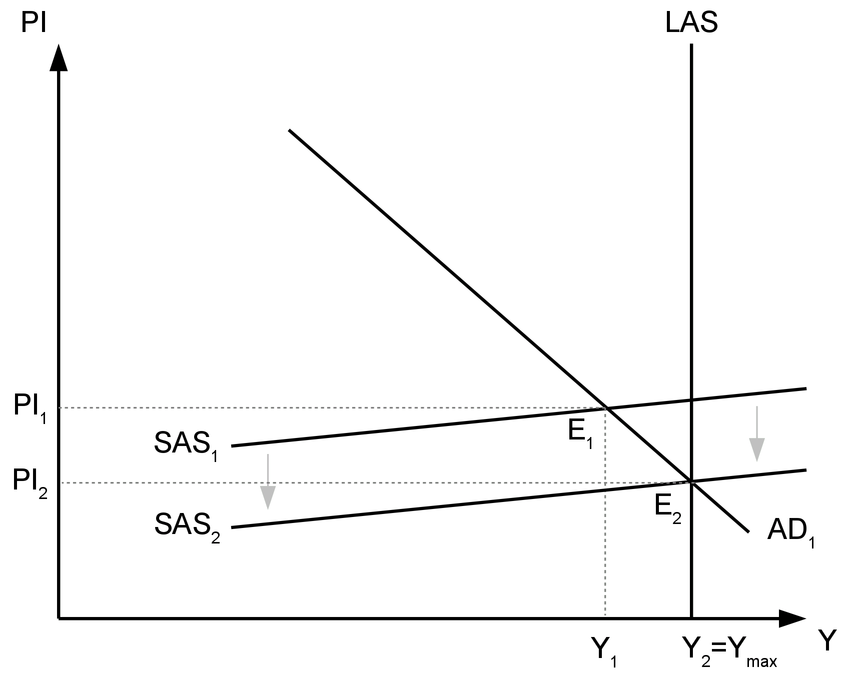
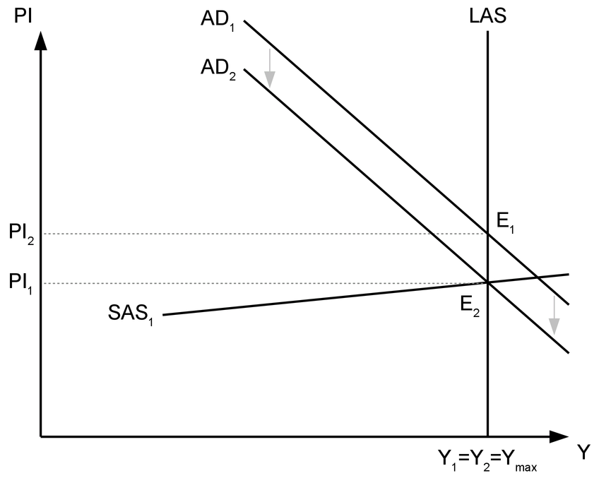

title: "Фискална политика"
author: "Александър Косулиев"
date: "12.12.2015"
output: 
  pdf_document: 
    toc: yes
    toc_depth: 3
    latex_engine: xelatex
mainfont: Liberation Serif
sansfont: Liberation Sans
monofont: Liberation Mono
---

# Фискална политика

## 1. Основни виждания за публичните финанси

### 1.1. Класическо виждане за публичните финанси

Виждането на представителите на класическата икономическа школа
е, че държавния бюджет трябва да бъде *балансиран* и *сдържан*.

__Балансираността на бюджета__ означава, че приходите и разходите
трябва да са приблизително равни. Когато разходите превишават
приходите е налице бюджетен дефицит, който трябва да се финансира
по някакъв начин. Една от възможностите е да се използват
натрупаните средства във фиксалния резерв, но продължителното
реализиране на дефицити неминуемо води до необходимостта от
финансирането им със заеми. Така политиката на бюджетни дефицити
е свързана с увеличаването на държавния дълг. Тъй като
обслужването на дълга може да създаде проблеми за самото
правителство и за националната икономика като цяло (за това ще
стане дума по-нататък), е препоръчително дефицитите да се
избягват. 

Когато приходите превишават разходите имаме бюджетен излишък.
Тази част, с която приходите превишават разходите, позволява да
се попълва фискалния резерв на държавата, който може да се
използва в случай на нужда при появата на непредвидени разходи.
Макар че е по-добре в бюджета да има излишъци, отколкото
дефицити, продължителното формиране на големи излишъци също не е
добра тенденция. Това означава, че държавата системно
изземва от населението повече, отколкото е необходимо, с което
лишава стопанските агенти от възможността да използват тези
средства по собствено усмотрение. 

Затова според класическите икономисти добрият бюджет е
балансираният бюджет или бюджет с малки излишъци.

__Сдържаността на бюджета__ означава, че балансираността трябва
да се осъществява на едно ниско равнище на държавните разходи.
Възможно е големите държавни разходи да се покрият от голям
размер на приходите, но според класическите икономисти държавата
трябва да ограничи разходите си до такова ниво, което осигурява
средства за основните функции на държавата, които позволяват
безпроблемното действие на пазарния механизъм. Тоест, от бюджета
трябва да се финансират законодателната и изпълнителната власт,
както и правоохранителните и правораздавателните органи - армия,
съд, полиция, прокуратура. Когато те функционират както трябва,
правата на собственост са защитени и се гарантира спазването на
договорните задължения, което е предпоставка за съществуването на
една пазарна икономика. 

Защо класическите икономисти са против натрупването на **държавен
дълг**? 

* Когато дългът е висок, обслужването му може да наложи
орязване на държавните разходи дори отвъд санитарния минимум,
който осигурява безпроблемното функциониране на пазара. 
* Друг вариант е да се увеличат данъците, но това ще намали
стимулите за частна инициатива и ще доведе до по-слаба
икономическа активност.  
* Високите нива на задлъжнялост обикновено водят да повишаване на
лихвените проценти, което отразява риска от прекратяване на
обслужването на дълга. Колкото по-висок е дългът, толкова
по-вероятно е всяко следващо правителство да откаже да прави
плащания по него с мотива, че задълженията са натрупани от
техните политически противници и те не носят отговорност за
действията на предишните управляващи.  Несигурността по отношение
на държавните финанси може да се пренесе на финансовите пазари в
страната.  По-високите лихвени проценти затрудняват достъпа до
заемни средства за фирмите и гражданите и също намаляват
икономическата активност. 
* Високите нива на задлъжнялост създават очаквания за инфлация,
особено когато централната банка е под контрола на
правителството. В ролята си на голям длъжник, правителството има
интерес от това да заработи "печатницата за пари", с което
реалната стойност на дълга ще намалее. Очакванията за висока
инфлация също създават несигурност в стопанската среда и оказват
негативно влияние върху икономическата активност.

### 1.2. Кейнсианско виждане за публичните финанси

Икономисти като Джон Мейнард Кейнс и неговите последователи имат
друго разбиране за държавния бюджет. Според тях балансираността
на бюджета идва на определена цена, която не винаги си заслужава
да бъде платена. По време на криза икономическата активност
намалява, при което спадат приходите в бюджета. За да го
балансира, държавата трябва да намали разходите. Но намаляването
на разходите на правителството при една и без това навлязла в
криза икономика, ще доведе до допълнително свиване на съвкупното
търсене и допълнителни проблеми за фирмите да намерят реализация
на продукцията си, които и без това вече срещат достатъчно
трудности. Това ще намали допълнително производството и заетостта
и ще предизвика задълбочаване на кризата и ще я направи
по-продължителна. 

Според кейнсианците по време на криза правителството не трябва да
се стреми към балансиран бюджет, а напротив - да увеличава
разходите, дори това да означава по-големи дефицити. Но тези
по-големи дефицити стимулират съвкупното търсене и са
предпоставка за по-бързото излизане от кризата. Колкото по-бързо
националната икономика излезе от кризата, толкова по-лесно ще
може да се балансира бюджета. С подобряването на икономическата
активност необходимостта от поддържане на големи държавни разходи
за стимулиране на съвкупното търсене намалява, а в същото време
приходите от данъци се увеличават. Така в периоди на оживление и
подем правителството може не просто да поддържа балансиран
бюджет, а да реализира бюджетни излишъци. С излишъците по време
на възходящите фази на стопанския цикъл то може да финансира
дефицитите по време на криза. Така едновременно се стимулира
икономиката и се избягва трупането на държавен дълг.

Според кейнсианците е грешно балансирането на бюджета в рамките
на една календарна година да се поставя като самоцел.
Астрономическото време има малко общо с икономическата активност
и не трябва да служи като критерий за периода на балансиране на
бюджета. Националното стопанство има свой собствен пулс и ритъм и
ръководейки се от него, икономическата логика предполага бюджетът
да се балансира в рамките на стопанския цикъл, а не на
календарната година.

Ако трябва да обобощим кейнсианското виждане, те разглеждат
бюджета като инструмент, с който можем да повлияем върху фазите
на стопанския цикъл. Това са т.нар. __функционални
финанси__. Провеждането на фискална политика предполага наличието
на функционални финанси. __Фискалната политика__ е процес на
формирането на приходите и разходите в държавния бюджет с цел
постигането и поддържането на икономически растеж, висока заетост
и ценова стабилност. Не всички приходи и разходи в бюджета са
проява на фискална политика. Класическото разбиране за държавните
финанси също предполага приходи и разходи в бюджета, но те нямат
като непосредствена цел заетостта и растежа. Те са необходими
дотолкова, доколкото осигуряват функционирането на пазара. А
пазарът сам се грижи за всичко останало. Например разходите за
съдебната власт се правят независимо дали икономиката е в криза
или подем. Фискалната политика предполага използването на бюджета
за изглаждането на фазите на стопанския цикъл, което е
несъвместимо с класическото и съвпада с кейнсианското разбиране
на обществените финанси.

## 2. Инструменти на фискалната политика

* Инструменти, които влияят върху съвкупното търсене
  - държавни разходи (G). 
  - данъци (Т)

Според привържениците на фискалната политика промяната както в
държавните разходи, така и в данъците, може да доведат до промени
в съвкупното търсене. Държавните разходи влияят върху него
директно, докато промените в данъците влияят върху размера на
разполагаемия доход и от там - върху съвкупното търсене.  Дори
измененията в държавните разходи (и домакинските разходи при
промяна в данъците) оказват по-силно влияние върху националния
доход и производството, отколкото е размерът на тези разходи.
Причината за това е т.нар. разходен (наричан още кейнсиански)
мултипликатор (при промяната на данъците мултипликаторът се
нарича данъчен). __Мултипликаторът__ показва колко пъти се
мултиплицира първоначалната промяна на разходите в икономиката и
какъв е нейният ефект върху националния доход. Веднъж влезли в
икономиката, парите продължават да се въртят, макар и със
затихваща сила. 

Ако например правителството започне строителство на магистрала,
заплатите на работниците ще им позволят да си купят стоки и
услуги, които преди са били недостъпни за тях. Нека приемем, че
даден работник реши да си смени дограмата. За собственика на
фирмата за поставяне на дограми, това е допълнителен доход над
обичайния. С него той ще може да си купи нов телефон и т.н..
Първоначалният паричен стимул предизвиква верига от
покупко-продажби, макар и всяко звено в нея да е с по-малка
стойност от следващата. Това е резулат от склонността на хората
да не харчат целия новополучен доход, а да спестяват част от
него. Което означава, че големината на мултипликатора ще зависи
от склонността към спестяване. 

Според привържениците на фискалната политика разходният
мултипликатор може да превишава 2, т.е. ако правителството
похарчи 500 милиона лева за строеж на магистралата, това ще
стимулира националното производство с 500х2 = 1 милиард лева.
Според противниците на фискалната политика мултипликаторът е
по-малък от 1, а в повечето случаи клони към 0.  Тогава стимулът,
който получава националната икономика от увеличените
правителствени разходи, е по-малък от самата сума на разходите.
Някои причини за това са посочени в точка 4.  

* Инструменти, които влияят върху съвкупното предлагане
  - субсидии
  - данъци (Т)

Производствените субсидии имат ефекта на намаляване на
производствените разходи и изместват кривата на предлагане надолу
и надясно. Освен влияят върху съвкупното търсене, промените в
данъците могат да повлияят и върху съвкупното предлагане, защото
променят стимулите за труд. Като знаят, че по-ниските данъци
означават по-висок разполагаем доход, хората ще са склонни да
работят повече. По-ниските данъци стимулират и производството на
фирмите, защото при равни други условия водят до по-високи
печалби.

## 3. Видове фискална политика

* __Експанзионистична (разширителна) политика__ - може да бъде
насочена както към стимулиране на съвкупното търсене (AD), така и
към стимулиране на краткосрочното съвкупно предлагане (SAS).
Провежда се по време на _рецесионен разрив_ (т.е. при рецесия).
Целта е да се стимулира икономическата активност и да се постигне
макроикономическо равновесие при пълна заетост. Осъществява се
като се увеличат правителствените разходи и субсидии и се намалят
данъците.

На долната графика е показано действието на експанзионистична
политика, стимулираща съвкупното търсене. С увеличаването на
съвкупното търсене кривата се измества нагоре и надясно и
това води до формиране на ново равновесие в при пълна заетост.

 

Подобно движение на националната икономика и формирането на ново
равновесие при пълната заетост може да се постигне и със
стимулиране на краткосрочното съвкупно предлагане. Това е
показана на графиката:

* __Рестриктивна (ограничителна) политика__ - насочена е главно
към ограничаване на съвкупното търсене (AD). Провежда се при
_инфлационен разрив_ (т.е.  при "прегряване" на икономиката),
когато прекалено голямото съвкупно търсене при пълна заетост
създава предпоставки за покачване в общото ценово равнище.
Осъществява се като се намалят правителствените разходи и се
повишат данъците.

На долната графика свиването на съвкупното търсене води до
формирането на ново равновесие при същото равнище на производство
и заетост, но при по-ниско ценово равнище.

## 4. Ограничения пред фискалната политика

Съществуват ограничения при провеждането на фискалната политика,
които намаляват нейната ефективност. Тези ограничения са
изтъквани основно от последователите на класическата икономическа
школа. Привържениците на кейнсианската школа смятат, че голяма
част от критиките са необосновани. 

* Изтласкващ ефект - когато държавните инвестиции изтласкат
частните инвестиции от пазара. Проявява се чрез увеличението на
лихвения процент. Държавата има няколко начина да финансира
повишаването на разходите си. Най-добрият вариант е да се
прибегне до средствата във фискалния резерв. Ако това не е
възможност, правителството трябва да увеличи данъците или да
тегли заем. Изтласкващият ефект се проявява при последната опция.
Тъй като правителството се нуждае от голяма сума, за да стимулира
иономиката, търсенето на заемни средства се повишава осезаемо и
това намира отражение в по-високата им цена. Цената на заемните
средства е лихвеният процент. При повишаване на лихвените
проценти, алтернативната цена на инвестициите се увеличава и
фирмите се отказват от някои инвестиции, защото очакваната
възвръщаемост от тях става по-малка от лихвените проценти. Така
производството и заетостта нарастват заради увеличените държавни
разходи, но спадат в частния сектор.
	
	Според привържениците на фискалната политика проявлението
на изтласкващия ефект е толкова по-силно, колкото по-близо
икономиката се намира до равнището на пълна заетост. Но тогава
необходимостта от провеждането на експанзионистична фискална
политика и без това е малка. Логично е да се стимулира икономика,
която се намира в рецесия. Тогава инвестиционните възможности са
ограничени и търсенето на заемен капитал е ниско. Свитото търсене
на заеми предполага  нисък лихвен процент.  Увеличаването на
държавните разходи може да го повиши, но заедно с това ще се
увеличат и възможностите за печеливши инвестиции от страна на
частните фирми. При това очакваната възвръщаемост за повечето от
тези новооткрити инвестиционни възможности ще расте по-бързо от
лихвените проценти. Тогава изтласкващ ефект няма да има. 

* Компенсиращ ефект - когато увеличените правителствени разходи
са съпътствани от намалени разходи на домакинствата. Може да се
наблюдава, когато повишението на правителствените разходи се
финансира с увеличаване на данъците. Възможно е обаче да се
получи и когато правителството финансира повишените си разходи
със заеми. Компенсиращият ефект, когато увеличението на
правителствените разходи се финансира с повишение на данъците, е
очевиден. Правителството наистина харчи повече, но за сметка на
домакинствата, чието търсене намалява заедно с разполагаемия им
доход. 

	Според някои последователи на класическата икономическа
школа, този ефект ще се наблюдава и при финансиране на
нарасналите държавни разходи със заеми. Логиката е, че хората ще
знаят, че заемите трябва да се връщат след определено време. За 
да ги изплаща, правителството ще се нуждае от повече приходи, 
заради което ще увеличи данъците в един бъдещ период.
Домакинствата започват да спестяват още отсега, за да посрещнат
бъдещото увеличение на данъците, което означава, че има спад в
потреблението през текущия период. Не всички икономисти са
съгласни, че нещата ще се развият по този начин. Според тях това
предполага висока икономическа култура и дългосрочен хоризонт,
който не е характерен за повечето домакинства.

* Отвореност на икономиката - описаният по-горе механизъм на
действие на разходния мултипликатор предполага икономика, която
няма връзки с външния свят. Тогава първоначалният стимул, получен
от увеличението на правителствените разходи, ще остане в
националната икономика, защото движението на парите ще се
осъществява изцяло в нея. Но в действителност хората харчат
част от дохода си за вносни стоки. Колкото по-отворена е една
икономика, толкова по-малък е мултипликаторът и по-неефективна е
фискалната политика.
	
* Лагове на фискалната политка - идентифицирането на проблема,
вземането на решение какво да се прави, привеждането на мерките в
действие и появата на ефективността от тях се проявяват с
известно забавяне. Понякога между появата на проблема и влиянието
на мерките, предприети срещу него, може да измине повече от
година. Дотогава възникналият проблем вероятно вече е отминал от
само себе си. Дори в някои случаи ефектите от държавната намеса
могат да се проявят в неподходящ момент. Например, ако е
провеждана експанзионистична политика, мерките от нея могат да
дадат резултат, когато икономиката е в подем и това да
предизвиква инфлационен разрив. 

	Едно възможно решение срещу лаговете на фискалната политика 
са __автоматичните фискални стабилизатори__. Те са вградени
институционални механизми, които се задействат автоматично при
промени в стопанския цикъл и действат в противоположна на
неговите фази посока. Пример за такива стабилизатори са помощите
за безработни и прогресивното данъчно облагане. Когато
икономиката изпадне в криза, се увеличава броят на безработните и
моблите за обезщетения при безработица. Тъй като последните са
елемент на държавните разходи, тези разходи се увеличават.
Обратно, когато икономиката е в подем, хората, които получават
такива помощи намаляват, а заедно с тях и държавните разходи.
Прогресивното данъчно облагане също има своеобразен антицикличен
характер. При криза доходите на хората спадат. Но при прогресивно
данъчно облагане спадът в нетния доход ще бъде по-малък,
отколкото при брутния доход. 

