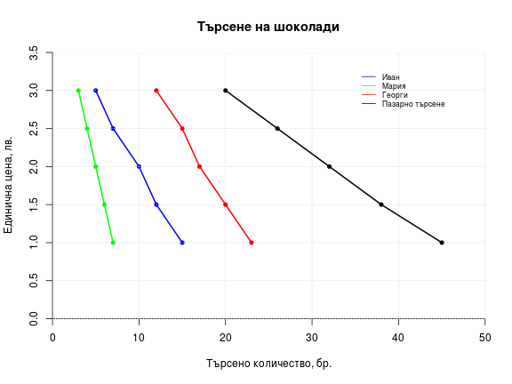

---
title: "Лекция 2. Пазар и пазарен механизъм"
author: "Александър Косулиев"
date: "26.09.2015"
output: html_document
---

# Пазар и пазарен механизъм

## 1. Основни категории на пазара.

__Стока__ - Благо, което се разменя на пазара. Благата, които
съществуват в готов вид в природата или се произвеждат за
собствено потребление, не са стоки.  Те стават такива в процеса
на размяната.  Благото е нещо материално или нематериално, което
задоволява някаква човешка потребност.

__Цена__ - Цената на дадена стока показва срещу какво
количество други стоки се разменя тя на пазара. Цената може да
бъде изразена във всякакви други стоки, но при достатъчно
развити пазарни отношения обикновено тя се изразява в пари.
_Парите_ са особен вид стока, която притежава определени
характеристики, улесняващи размяната. Те изпълняват няколко
основни функции - мярка за стойността, средство за размяна и
средство за натрупване. Това е възможно, защото парите като
стока притежават специфични качества - оскъдност, делимост,
трайност, обща разпознаваемост, лесна преносимост.

__Конкуренция__ - Пазарната конкуренция е процес, при който
отделните стопански единици се опитват да реализират целите си,
при наличието на други, които се опитват да направят същото.
Обикновено под конкуренция се разбира поведението на
производителите, които си съперничат за потребителския интерес,
но тя е налице и при потребителите, които си съперничат за
придобиването на ограничените блага, създавани от
производителите.

## 2. Свойства и функции на пазарния механизъм

Пазарният механизъм е __саморегулиращ се механизъм__, който
координира действията на участниците на пазара така,
че излишъците и дефицитите се преодоляват сравнително бързо, а
ресурсите се насочват към производството на онези блага, които в
най-голяма степен съответстват на нуждите и желанията на
обществото. Той е в състояние да обобщи предпочитанията на
милиони участници на пазара и същевременно да сигнализира за
относителната оскъдност на онези блага, които представляват
интерес за отделния потребител или производител. 

Това е __информационната функция__ на пазара.  Тя се осъществява
посредством цените, които едновременно се формират от и влияят
на действията на пазарните участници.  Тя е тясно свързана с
неговата __мотивираща функция__, тъй като на базата на
информацията, която получават, производителите и потребителите
променят поведението си по такъв начин, че да извлекат
най-голяма изгода. Производителите са стимулирани да произвеждат
стоки и услуги, където относителната оскъдност е висока, защото
ще реализират по-голяма печалба. Потребителите са стимулирани да
разкрият истинските си предпочитания, защото в противен случай
може да не получат стоките и услугите, които желаят. Така
стигаме и до __разпределителната функция__ на пазара. Тъй като
благата са ограничени, не всеки може да получи всичко, каквото
иска. Тя също се проявява чрез действието на цените.

Формирането на цените е следствие от поведението на
производителите и потребителите, което на пазара намира
отражение в търсенето и предлагането.

## 3. Пазарно търсене и пазарно предлагане

### Пазарно търсене

Пазарното търсене представлява желанието и възможността на
хората да закупят определено количество от дадена стока при
определена цена.

Законът за търсенето гласи, че съществува обратна зависимост
между цената на дадена продукт и търсеното от него количество.
Тоест, когато цената е висока, търсеното количество е малко и
когато цената е ниска, търсеното количество е високо.

Тази зависимост е следствие от закона за намаляващата пределна
полезност.  Според него полезността, която извличат хората от
-всяка следваща потребявана единица от дадено благо, е по-малка от
вода ще му донесе определено задоволство, но не толкова, колкото
първата. Това означава, че той ще я цени по-малко и съответно,
ако трябва да плаща за нея, ще е склонен да плати по-малко,
отколкото за първата.

#### Крива на търсенето

Кривата на търсене представя графично обратната зависимост между
цената и търсеното количество. Нека разгледаме търсенето на
шоколад от един примерен потребител Иван.

Цена, лв. |Търсене (от Иван), бр.
----------|----------------------
3   | 5
25  | 7
2   | 10
1.5 | 12
1   | 15

Представено графично, то би изглеждало по следния начин. 

 

Нека да добавим още двама потребители - Мария и Георги.

Цена |Търсене (Иван)| Търсене (Мария)| Търсене (Георги)
-----|--------------|----------------|------------------ 
 3.0 |   5   |  3   |  12 
 2.5 |   7   |  4   |  15 
 2.0 |  10   |  5   |  17 
 1.5 |  12   |  6   |  20 
 1.0 |  15   |  7   |  23 

 

Когато се сумират кривите на индивидуалното търсене на всеки от
потребителите, получаваме кривата на пазарното търсене.

Цена |Търсене (Иван)| Търсене (Мария)| Търсене (Георги)|Пазарно търсене
-----|--------------|----------------|-----------------|---------------- 
 3.0 |   5   |  3   |  12  | 20
 2.5 |   7   |  4   |  15  | 26
 2.0 |  10   |  5   |  17  | 32
 1.5 |  12   |  6   |  20  | 38
 1.0 |  15   |  7   |  23  | 45

 

#### Детерминанти на търсенето

Освен от цената, търсенето се определя и от други фактори. За
разлика от промяната в цената, при които е налице намаление или
увеличение на търсеното количество като оставаме на същата
крива, при изменение в другите фактори промяната в търсеното
количество води до изместване на цялата крива на търсене.

Такава промяна може да настъпи при търсенето на шоколад при
Иван, ако доходът му спадне или се повиши.

Цена |Търсене | Търсене при по-нисък доход|Търсене при по-висок доход
-----|--------|---------------------------|---------------------------
 3.0 |   5   |  2  | 7 
 2.5 |   7   |  3  | 9 
 2.0 |  10   |  5  | 11 
 1.5 |  12   |  8  | 15 
 1.0 |  15   |  12 | 19  

 

Факторите, които изместват кривата на търсене, настъпват при
изменение на:

1. Цената на другите стоки (заместващи или допълващи)  
2. Дохода на потребителите  
3. Вкусовете и предпочитанията на потребителите  
4. Потребителските очаквания
5. Размера на пазара (броя потребители) 

### Пазарно предлагане

Пазарното предлагане представлява желанието и способността на
производителите и продавачите да предлагат определено количество
от даден продукт на определена цена.

Законът за предлагането гласи, че съществува права зависимост
между цената на даден продукт и предлаганото от него количество.
Това означава, че при ниска цена предлагането също ще бъде
ниско, а при висока цена - високо. 

Докато законът за търсенето е следствие от закона за
намаляващата пределна полезност, законът за предлагането е
обвързан с производствените разходи и факта, че по-високата цена
означава по-голяма печалба при равни други условия, а с това и
стимулите да се произвежда повече са по-големи за отделния
производител.  Ако разглеждаме пазарното предлагане в отрасъла
като цяло, с увеличаването на цените ще става възможно
навлизането на пазара и на други, по-ниско производителни фирми,
а с това и предлагането като цяло ще расте. 

#### Крива на предлагането

Кривата на предлагането отразява правата зависимост между
предлагане и цена. 

На таблицата е изобразено предлаганото количество на даден
продукт от Фирма 1 (в бройки) за всяко равнище на
цените (в лева).

Цена  |  Фирма 1 
------|----------
1     |  50      
1.5   |  70      
2     |  100     
2.5   |  130     
3     |  150     

 

Аналогично на търсенето и тук отрасловата крива на предлагането
е сума от кривите на индивидуалните производители.

Цена  |  Фирма 1  |  Фирма 2  |  Фирма 3|Пазарно предлагане
------|-----------|-----------|---------|-------------------
1     |  50       |  70       |  0      | 120
1.5   |  70       |  100      |  50     | 220
2     |  100      |  120      |  65     | 285
2.5   |  130      |  150      |  90     | 370
3     |  150      |  170      |  110    | 430

 

#### Детерминанти на предлагането

Промяната в цената води до промяна в предлаганото количество.
Освен нея, има и други фактори, които водят до такава промяна.
Графично те се представят с изместване на кривата надолу и
надясно (увеличаване на предлагането) или нагоре и надясно
(намаляване на предлагането).

 

Изместването на кривата на предлагане е резултат от изменението
в един от следните фактори:

1. Цената на другите стоки (които са по някакъв начин свързани с
въпросната стока в производството, защото използват една и съща
суровина или технология)     
2. Цената на ресурсите  
3. Технологиите  
4. Очакванията на производителите и продавачите    

## 4. Пазарно равновесие

Пазарното търсене и пазарното предлагане не действат независимо
един от друг. Пазарното равновесие се определя при
едновременното влияние както на едното, така и на другото. 

#### Пазарен дефицит

Когато цената е под равновесната, търсеното количество превишава
предлаганото количество и се наблюдава дефицит. При свободен
пазар цената започва да се повишава, което води до спад в
търсенето и увеличение на предлагането, което постепенно
елиминира дефицита. 

 

#### Пазарен излишък

Когато цената е над равновесната, предлаганото количество
превишава търсеното количество и се наблюдава излишък. При
свободен пазар цената започва да пада, което води до спад в
предлагането и увеличаване на търсенето, което постепенно
елиминира излишъка.

 

#### Пазарно равновесие и равновесна цена

Пазарно равновесие е налице тогава, когато търсеното и
предлаганото количество са равни. Цената, при която се
осъществява това равенство, се нарича равновесна цена. 

 

### Нарушаване и възстановяване на пазарното равновесие

При изменение в някой от факторите, които влияят върху търсенето
или предлагането, пазарното равновесие се нарушава. Посредством
изменение в цената настъпват приспособителни процеси, които
водят до възстановяване на равновесието.

Тук ще разгледаме два такива примера. При първия от тях настъпва
увеличение в доходите на потребителите.  Това ще доведе до
изместване на кривата на търсене нагоре и надясно, което показва
повишено търсене на съответния продукт.  Изменението в дохода
обаче оказва влияние само търсенето.  Така при запазване на
старата цена потребителите ще желаят да закупят по-голямо
количество от преди, но склонността и възможностите на
продавачите да предлагат при тази цена остават едни и същи. Това
води до появата на дефицит. Като следствие от него цената започва
да расте, с което търсеното количество започва да пада, а
предлагането - да расте и в крайна сметка се достига до ново
пазарно равновесие при нова, по-висока цена и и по-голямо
равновесно количество от преди.

 

При втория пример поевтинява суровината за производството на
даден продукт. При неизменна крайна цена това означава по-голяма
печалба за производителите, което ги стимулира да произвеждат
повече. За потребителите обаче склонността и възможностите да
потребяват при тази цена остават същите както и преди. Това води
до появата на излишък, вследствие на който цената започва да
пада и равновесието се възстановява при по-ниска цена и
по-голямо количество.

 
