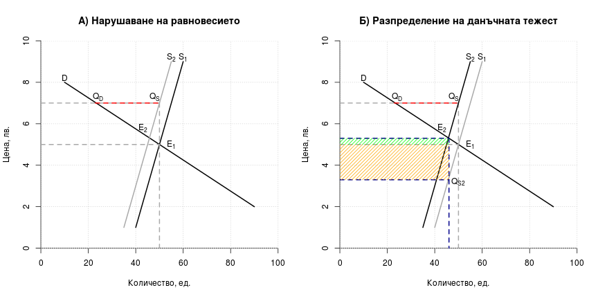
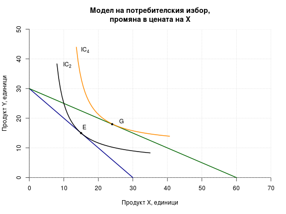

# Лекция 3. Еластичност на търсенето и предлагането. Потребителско поведение

## 1. Еластичност

### 1.1. Обща характеристика

__Еластичността__ показва чувствителността на количествената
промяна при настъпването на промяна в някаква друга величина.
Промяната в количеството може да бъде както на търсенето, така и
на предлагането, а промяната на другата величина може да бъде
цената на самия продукт, цената на друг продукт, или дохода.
Съпоставят се относителните промени във величините. Най-често се
разглежда еластичността на търсенето спрямо цената и именно тя щя
бъде използвана за отправна точка при обяснението на
еластичността като понятие. 

Коефициентът на ценовата еластичност на търсенето се изчислява по формулата:

$$E_{D_{P}}=\frac{%\DeltaQ}{%\DeltaP}$$

 


 


 


 

 

```
## png 
##   2
```

 

```
## png 
##   2
```


|Продукт X|Продукт Y|Полезност|
|---------|---------|---------|
| 3 бр.| 27 бр. | 50 ед. |
| 5 бр.| 17 бр. | 50 ед. |
| 7 бр.| 10 бр. | 50 ед. |
| 9 бр.| 7 бр.  | 50 ед. |
| 11 бр.| 4 бр. | 50 ед. |
| 13 бр.| 2 бр. | 50 ед. |
| 15 бр.| 1 бр. | 50 ед. |


 

 

 

 

 

 


 

 

```
## png 
##   2
```
