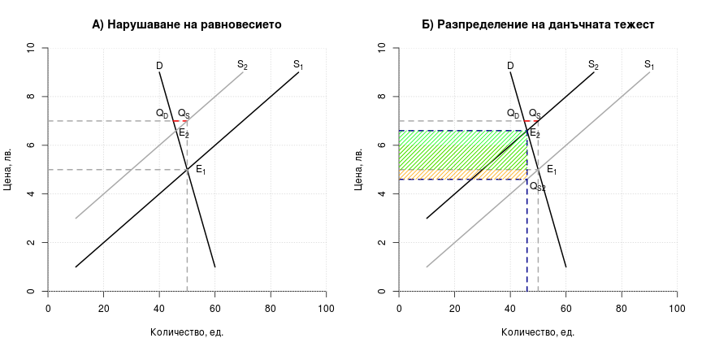
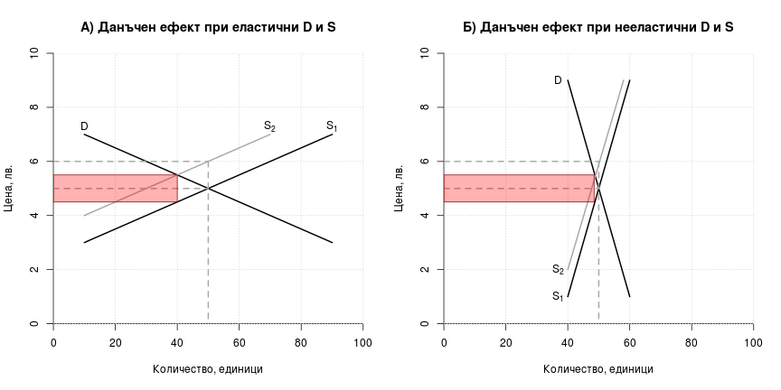
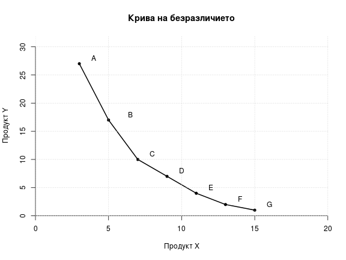
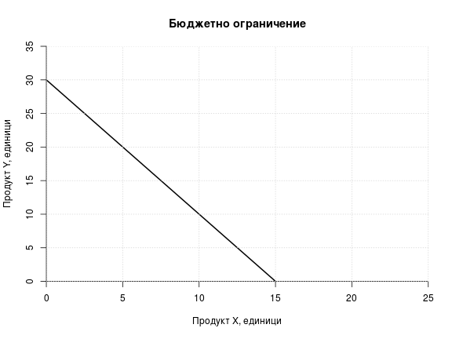

# Лекция 3. Еластичност на търсенето и предлагането. Потребителско поведение

## 1. Еластичност

### 1.1. Обща характеристика

__Еластичността__ показва чувствителността на количествената
промяна при настъпването на промяна в някаква друга величина.
Промяната в количеството може да бъде както на търсенето, така и
на предлагането, а промяната на другата величина може да бъде
цената на самия продукт, цената на друг продукт, или дохода.
Съпоставят се относителните промени във величините. 

### 1.2. Видове еластичност

#### 1.2.1. Еластичност на търсенето спрямо цената

Най-често се разглежда еластичността на търсенето спрямо цената и
именно тя щя бъде използвана за отправна точка при обяснението на
еластичността като понятие. На долната графика са показани две
криви с различна ценова еластичност на търсенето. При една и съща
промяна в цената изменението в търсеното количество е по-голямо
при крива 1, отколкото при крива 2, което означава, че и нейната
еластичност е по-голяма. Колкото по-стръмна е полегата е кривата,
толкова по-голяма еластичност отразява. Макар че двете криви се
различават по отношение на еластичността си, еластичността не се
запазва една и съща в рамките на една и съща крива. В горния край
на кривите, търсенето е по-еластично спрямо цената, отколкото в
долния им край (използвайте посочената по-долу формула и данните
от кривите, за да разберете сами защо).

 
\

Коефициентът на ценовата еластичност на търсенето се изчислява по
__формулата__:

$$ E_{D_{P}}=\frac{\% \Delta Q}{\% \Delta P} $$

Казано по друг начин, коефициентът на еластичност е равен на
отношението между процентното изменение на търсеното количество и
процентното изменение на цената. Представена по-подробно,
формулата изглежда по следния начин:

$$ E_{D_{P}}=\frac{(Q_2-Q_1)/(Q_2+Q_1)}{(P_2-P_1)/(P_2+P_1)} $$

Тук $P_1$ и $Q_1$ са първоначалната цена и количество, 
а $P_2$ и $Q_2$ са
новата цена и новото търсено количество.

При изчисляването на коефициента на ценова еластичност на
търсенето винаги получаваме отрицателно число, което отразява
обратната зависимост между цена и търсено количество. Ние
игнорираме знака минус, тоест използваме модулната стойност на
получения резултат, за да правим по-нататъшно сравнение.

Ако Е>1, тогава е налице еластично търсене. Ако E<1, търсенето е
нееластично. При E=1 (частен случай, който е малко вероятен)
търсенето е с единична еластичност спрямо цената. Търсенето е
съвършено нееластично, ако E=0 и съвършено еластично, ако Е клони
към безкрайност. В първия от тези случаи изменението в цената не
води до никаква промяна в търсенето, а при втория - малки
изменения в цената водят до значителни изменения в търсенето
(леко повишение отказва напълно потребителите или леко понижение
ги стимулира да търсят цялата налична продукция). 

__Факторите__, оказващи влияние върху еластичността на търсенето
са:

* наличието или отсъствието на заместители. Колкото по-близки
  заместители има, толкова по-голяма е еластичността на търсенето
  спрямо цената;
* стоки, към които се привиква. Стоки като цигари и наркотици
  могат да създадат зависимост у потребителя до степен, в която
  той не вижда близки заместители у други стоки. При това
  положение търсенето ще бъде нееластично;
* дял на разходите за стоката в общите разходи на потребителя.
  Колкото по-малък е той, толкова по-нееластично ще бъде
  търсенето. Увеличаването му създава по-голяма тежест за
  потребителя, което го стимулира в по-голяма степен да промени
  потребителското си поведение;
* времеви период. Обикновено еластичността е по-голяма в по-дълъг
  период от време, защото позволява адаптирането на вкусовете и
  предпочитанията към други продукти или защото е по-вероятно да
  се появят стоки-заместители.

#### 1.2.2. Еластичност на предлагането спрямо цената

Графиката показва криви, отразяващи предлагане с различна
еластичност спрямо цената. И тук по-полегатата крива означава
по-еластично предлагане. 

 
\

Коефициентът на еластичност на предлагането спрямо цената се
намира при съотнасянето на процентното изменение в предлаганото
количество към процентното изменение в цената, която го е
породила. Формулата е следната:

$$ E_{S_{P}}=\frac{\% \Delta Q}{\% \Delta P} $$

Разширената формула за пресмятане на коефициента е същата както
при търсенето, с тази разлика, че вместо търсено количество, $Q_1$
и $Q_2$ в числителя ще се отнасят до предлагано количество.
Полученият коефициент в случая винаги ще бъде положителен, тъй
като отразява правата зависимост между цена и предлагано
количество. Съпоставката на коефициента и тук е спрямо единица.

#### 1.2.3. Еластичност на търсенето спрямо дохода

Еластичността на търсенето спрямо дохода показва колко
чувствително е търсенето при промени в дохода. Формулата за
пресмятането е следната:

$$ E_{D_{Y}}=\frac{\% \Delta Q}{\% \Delta Y} $$

Или записана разширено:

$$ E_{D_{Y}}=\frac{(Q_2-Q_1)/(Q_2+Q_1)}{(Y_2-Y_1)/(Y_2+Y_1)} $$

В нея $Y_1$ и $Q_1$ са първоначалният доход и цена, а $Y_2$ и $Q_2$ 
са доходът и цената след промените. 

За разлика от търсенето и предлагането, където знакът пред
коефициента е само един (съответно "-" или "+"), тук може да се
получи както отрицателен, така и положителен знак. Първият
показва, че става дума за малоценен продукт, а втория - за
нормален или луксозен (защото доходът и търсенето се изменят в
една и съща посока). При сравнението спрямо единица се използва
модулната стойност на коефициента.

#### 1.2.4. Кръстосана еластичност

Кръстосаната еластичност показва колко чувствително е изменението
в търсенето на един продукт, спрямо изменението на цената на друг
продукт.

$$ E_{AB}=\frac{\% \Delta Q_A}{\% \Delta P_B} $$

Във формулата $Q_A$ е количеството от продукт А, а $P_B$ е цената на
продукт B.

### 1.3. Значение на еластичността

#### 1.3.1. Значение при формирането на приходите на фирмата

При еластично търсене повишаването на цената от страна на фирмата
ще доведе до спад в получените приходи, а при понижаване на
цената - на увеличение на приходите. При нееластично търсене
увеличаването на цените води до повече приходи, а намаляването на
цените - до по-ниски приходи.

#### 1.3.2. Значение при данъчното облагане

Данъчната тежест се поема в по-голяма степен от този, чиято крива
е по-нееластична. На долната графика това е производителят. Пазарът
първоначално е в равновесие в т. $E_1$ при цена от 5 лв.
Правителството решава да обложи производителя с данък от 2 лв. на
единица продукция. Това ще доведе до нарушаване на равновесието.
На практика данъкът оказва същия ефект като повишаването на
производствените разходи и измества кривата на предлагането
нагоре и наляво. Ако производителят иска да продава същото
количество като преди, получавайки цена от 5 лв., потребителят ще
трябва да плаща 7 лв. (от които 2 лв. прибира държавата като
данък). Но тогава ще се получи излишък, показан с червената
отсечка $Q_D$ - $Q_S$. Приспособяването на пазара води до формирането
на ново равновесие в т. $E_2$ . Данъчната тежест е цялата
защрихована област на дясната графика, като тази в оранжев цвят е
тежестта, която се поема от прозводителя, а тази в зелено - от
потребителя. Тъй като търсенето е по-еластично от предлагането,
новата равновесна цена е нараснала много малко, в сравнение с
изходната позиция - от 5 лв. на 5,30 лв. и цената за
потребителите не е е увеличила много. Тъй като държавата
прибира 2 лв. от тези 5,30 лв. под формата на данъци, до
производителите достигат само 3,30 лв. Промяната за тях е много
по-голяма, отколкото за потребителите.

 
\

На следващата графика е показано как се разпределя данъчната
тежест, когато предлагането е по-еластично спрямо цената,
отколкото търсенето. Последователността на процесите е същата,
като описаната по-горе. Разликата идва от това, че ще се получи
по-малък излишък в отсечката $Q_D$ - $Q_S$, заради което новото
равновесие ще се формира при по-висока цена, отколкото в случая,
където търсенето е по-еластично от предлагането. При новото
равновесие потребителите ще плащат цена от 6.6 лв. (вместо 5
лв.). От тях държавата ще прибира като данък 2 лв. и до
производителите ще достигат 4.6 лв. (вместо 5 лв.). Очевидно е,
че разпределението на данъчната тежест се поема основно от
потребителя. На графиката тя е представена със зеления
правоъгълник. Тежестта за производителя е отбелязана в оранжево. 

 
\

Освен за производителя и за потребителя еластичността е важна и
за самата държава, тъй като имат отношение към размера на
събраните приходи. Колкото по-нееластични са търсенето и
предлагането спрямо цената, толкова по-големи са очакваните
данъчни приходи при равни други условия. Това е показано на
долната фигура, където данъчните приходи са оцветеният
правоъгълник. Неговата площ е по-голяма при нееластично търсене и
предлагане.

 
\

От гледна точка на държавата еластичността е важна и поради друга
причина. Често държавата отпуска в определени отрасли, за да 
стимулира заетостта и производството. Ако това са търсените цели,
логично е субсидията да се смята за по-успешна там, където
заетостта и производството са се повишили най-много. На долната
фигура са показани ефектите от субсидия при еластично и нееластично
търсене и предлагане. Нека разгледаме тази отляво.

Първоначално пазарът е в равновесие в $E_1$ при търсене D и
предлагане $S_1$. Равновесието се осъществява при цена от 5 лв. и
количество от 50 единици. Субсидия от 1 лв. би довела до това, че
при цена от 5 лв. производителите ще получават общо 6 лв. -
цената, която плащат потребителите + субсидията. Така при цена от
5 лв. производителите няма да предлагат 50 единици продукция
(както преди), а ще предлагат при онова количество, което
съответства на цена от 6 лв. при съответната крива на предлагане.
Така предлаганото количество вече е $Q_S = 70$ единици, докато
търсеното количество се запазва $Q_D = 50$ единици. Налице е
излишък $Q_D$ - $Q_S$, което ще доведе до появата на ново
равновесие.

Субсидията на практика има ефекта на понижаване на
производствените разходи с 1 лев. Графично това се представя с 
нова крива на предлагането $S_2$. Новото равновесие е там, където
тя се пресича с кривата на търсеното D. На новата равновесна
точка $E_2$ съответства сума от 4,5 лв., получавана от
производителите. От тях 3,5 лв. е цената, която плащат
потребителите, а 1 лев е субсидията, изплащана от държавата.
Новото равновесно количество е 60 единици продукция. На графиката
общата сума на субсидията е показана в зелен цвят.

Същата логика може да проследи движението и на графиката вдясно,
където е показан ефектът от субсидията при нееластично търсене и
предлагане. Вижда се, че след въвеждането на субсидията
производството се увеличава съвсем малко - от 50 на 53 единици.
Можем да направим извода, че ако целим да повишим заетостта и
производството, е по-добре да даваме субсидии в отрасли, където
търсенето и предлагането са еластични.

 
\

## 2. Потребителско поведение

Икономическият модел на потребителското поведение показва
оптималния избор, който прави всеки потребител, при наличието на
няколко ограничения. Първо, потребителят е ограничен от
собствените си вкусове и предпочитания. Второ, от относителната
оскъдност на благата, които иска да потребява, а тя намира
отражение в цените на благата. И трето - от неговите възможности
да придобие тези блага, тоест бюджетът, с който разполага.

### 2.1. Криви на безразличието

Ограниченията, които произтичат за потребителя от собствените му
вкусове и предпочитания, могат да бъдат представени с т.нар.
криви на безразличието. Преди това обаче е необходимо да бъдат
разгледани някои понятия, които имат отношения към нея. Това,
което подтиква потребителя към действие е съществуването на
някаква незадоволена потребност. *Потребността* е някакво
неудовлетворение, чувство на неудобство, породена от липсата на
нещо. Елиминирането на липсата премахва това чувство. В стопански
контекст тази липса се елиминира с придобиването и употребата на
някакво *благо*.  Благото е в състояние да задоволи тази
потребност, да премахне чувството на неудовлетворение. Заради
тази му способност ние му приписваме определена *полезност*. 

В икономиката се използват кардинална и ординална полезност.
*Кардиналната полезност* представя полезността като нещо
измеримо, подобно на мерките, които използваме за дължина, тежест
и т.н. Така както 2 метра показват два пъти по-голямо разстояние
от 1 метър, така и 2 утила (условно име за мерна единица за
полезност) показва два пъти по-голяма полезност от 1 утил. Такова
прецизно измерване на полезността обаче, поне засега се оказва
невъзможно. Много е трудно да се обясни на колко полезност се
равнява един утил и как полезността може да бъде наблюдавана и
представена в утили. Икономистите избягват да използват
кардиналната полезност, освен ако нямат друг избор. Най-често
това се прави с илюстративна цел, за да се обяснят някои явления
или процеси там, където с ординалната полезност това би било
невъзможно или трудно. При използването на *ординална полезност*
се допуска, че може да се прави сравнение между полезности, но не
и да се съпоставят с точност както при кардиналната полезност.
Когато сравняваме две блага може да кажем, че едното благо ни
носи повече, по-малко или също толкова полезност, колкото 
някакво друго благо, но не и да кажем, че едното благо ни носи
два или три пъти по-голямо полезност от другото.

*Кривите на безразличие* са графичен инструмент за представяне на
полезността. Те показват различните комбинации от две блага, при
които потребителят остава на едно и също равнище на полезност.
Тъй като тя е една и съща, за него е безразлично коя
комбинация точно ще избере.

На таблицата са показани комбинации от продукти X и Y с една и
съща полезност за потребителя.

|Комбинация|Продукт X|Продукт Y|
|---------:|--------:|--------:|
|  А  | 3 бр.| 27 бр. | 
|  B  | 5 бр.| 17 бр. | 
|  C  | 7 бр.| 10 бр. | 
|  D  | 9 бр.| 7 бр.  | 
|  E  | 11 бр.| 4 бр. | 
|  F  | 13 бр.| 2 бр. | 
|  G  | 15 бр.| 1 бр. | 

Графично това изглежда по следния начин.

 
\

Прави впечатление, че кривата е изпъкнала към началото на
координатната система. Това е резултат от *намаляващата пределна
полезност* при употребата на всяко от благата. При наличието на
намаляваща пределна полезност всяка следваща единица, която
потребяваме от благото, ни носи полезност, по-малка от
полезността, която ни е донесла предходната. 

Ако се намираме в т. А имаме само 3 единици от X и 27 от Y. Тъй
като количеството X е малко, полезността, която би ни донесла
всяка допълнителна единица от него, е сравнително голяма. И тъй
като имаме много единици от Y, ние извличаме сравнително малка
полезност от последните от тях. Заради това дори голяма загуба в
Y може да бъде компенсирана сравнително лесно от увеличение на X.
На графиката при движение от т. A до т. B 2 допълнителни единици
от X са достатъчни, за да останем на същото равнище на полезност
при намаление на Y с 10 единици. Не така стоят нещата, когато
имаме движение от т. C към т. D. Тогава имаме по-голямо
количество от X и полезността, която ще извлечем от
допълнителното му увеличение, ще бъде по-малка.  Обратно, тъй
като разполагаме с по-малко количество от Y, всяка единица от
него, от която се откажем, ще е свързана със загуба на по-голяма
полезност. Затова при движение от т. C до т. D полезността от 2
допълнителни единици X компенсира само загубата в полезността от
2 единици Y. 

 
\

Потребителските предпочитания могат да бъдат представени с
множество такива криви на безразличието, които показват различни
равнища на полезност за потребителя. Потребителите са безразлични
между комбинациите на една и съща крива на безразличие, но не и
между комбинациите, намиращи се на различни криви. На долната
графика потребителят ще бъде безразличен между точки B и D, но не
и между тях и точка H, която показва по-високо равнище на
полезност. Потребителят ще предпочете т. H пред т. B, защото може да
потребява повече от продукт X (9 вместо 5 единици) при едно и
също количество от Y (17 единици). Аналогично, т. H е
предпочитана пред т. D, защото при едно и също количество от X (9
единици), количеството от Y е по-голямо (17 вместо 7).
Ако има възможност, потребителят винаги ще предпочете точка от
синята крива на безразличие $IC_2$ пред точка от черната крива
$IC_1$.

 
\

За да бъде валиден, анализът на потребителските предпочитания на
базата на кривите на безразличие прави някои допускания. На първо
място се допуска, че потребителят винаги е в състояние да направи
сравнение между полезността от различните комбинации, с които се
сблъсква. На второ, смята се, че той е рационален и ако
комбинация B е предпочитана пред комбинация A, а комбинация C -
пред комбинация B, то комбинация C ще бъде предпочитана пред A, а
не обратното
(което означава, че кривите на безразличие не могат да се
пресичат).  Допуска се още, че пределната полезност (полезността
от всяка допълнителна единица) намалява, но никога не пада до
нула и не става отрицателна.

Освен това сравнението се прави за един абстрактен и неуточнен
като продължителност период. Очевидно величината на полезността е
различна, ако отчитаме фактора време. Петият шоколад в рамките на
един ден и петият шоколад в рамките на един месец биха донесли
съвсем различна полезност. Друга слабост на този инструмент е, че
е трудно приложим по отношение на предмети, които се купуват
рядко, или при които полезността се извлича в дълготрайна
употреба - например пералня или автомобил. Въпреки всичко той
дава една приблизителна представа за съществуващите вкусове и
предпочитания на потребителя.  

### 2.2. Бюджетно ограничение

Освен от собствените си вкусове и предпочитания потребителят е
ограничен и във възможността си да ги задоволи. Това ограничение
произтича от цените на продуктите и от бюджета, с който
разполага. То е показано на долната графика. Да предположим, че
потребителят има 30 лв., цената на продукт X е 2 лева, а на
продукт Y - 1 лев. Ако похарчи всичките си налични пари само за
продукт X, той може да закупи 15 единици от него. Ако ги похарчи
само за Y, той ще придобие 30 единици. Освен това той може да
изразходва целия си наличен бюджет за някаква комбинация от двата
продукта - например 20 единици от Y и 10 единици от X. 

 
\

Да приемем, че продукт X поевтинява от 2 лева на 1 лев. Как ще се
отрази това на линията на бюджетното ограничние? При бюджет от 30
лева потребителят ще може да закупи 30, вместо 15 единици от
продукт X. Ако преди е можел да закупи по 10 единици от X и 10
единици от Y (в т. А), то сега ще може да потребява по 10 единици
от X и 20 единици от Y (в т. B). Новото бюджетно ограничение е
представено със синята линия.  

 
\

Сега да разгледаме промените при първоначални цени от 2 лева за X
и 1 лев за Y и увеличение на бюджета от 30 на 60 лева. Това ще
доведе до изместване на линията на бюджетното ограничние нагоре и
надясно. За потребителя ще е възможно да купува вместо по 10
единици от продукт X и Y (т. А) по 20 единици (т. B).

 
\

### 2.3. Модел на потребителския избор

Как потребителят максимизира полезността си при съществуващите
предпочитания и бюджетно ограничение? Да предположим, че
потребителят разполага с 60 лева и цената на продуктите X и Y e 2
лева. При съществуващия бюджет очевидно точка F се намира на
крива на безразличие, която е недостижима. Потреблението на крива
$IC_1$ е възможно в точките A и B и всички между тях, например
точка C. При съществуващия бюджет е възможно да се потребява и на
по-висока крива на безразличие. Най-високата такава е кривата
$IC_2$, когато имаме само една допирателна точка между кривата и
линията на бюджетното ограничение и това е точка Е. Така при
съществуващите ограничения оптималното потребление е 15 единици
от X и 15 единици от Y.

 
\

Промяната в бюджетното ограничение ще доведе и до нова оптимална
комбинация от X и Y, която максимизира потребителската полезност.
На долната графика е показано какви промени ще настъпят при
поевтиняване на продукт X от 2 лева на 1 лев (при неизменен
бюджет от 60 лева и цена на Y от 2 лева).  Потребителят ще
извлече максимална полезност не в точка E (15 единици от единия и
15 от другия продукт), а в точка G. В точка G ще се потребява
както по-голямо количество от X (24 единици), така и от Y (18
единици).

 
\

Интересно е, че промяната в потреблението засяга не само X, макар
че се е променила единствено неговата цена. Има промяна и в
потреблението на Y, макар и по-малко, отколкото при X. Това се
дължи на т.нар.  *ефект на дохода*. Когато даден продукт
поевтинява, това води до увеличаване на реалния доход - макар
бюджетът номинално да остава същият (60 лева), по-евтиният
продукт освобождава средства за закупуването на повече продукти -
както на самия него, така и на други. Изменението при X е
по-голямо, защото при него действа не само ефектът на дохода, а и
*ефектът на заместването*. Последният е свързан с пренасочването
на парични средства към покупката на продукти, чиято цена пада.
По принцип ефектът на заместването се проявява по-силно от ефекта
на дохода.

Според това как се променя търсенето при изменение в цената и
дохода се наблюдават два вида стоки. Първият вид са
*нормални/луксозни* стоки. При тях изменението в дохода и
потреблението се движат в една и съща посока. Съответно и ефектът
на заместването и дохода ще се проявяват в една и съща посока. Не
така стоят нещата при *малоценните стоки*. Изменението в дохода
води до противоположно изменение в търсеното количество. Например
с увеличаването на дохода потреблението на салам „Камчия“ ще
намалее, защото потребителят ще търси по-качествени продукти от
същата категория. Когато се измени цената на малоценен продукт,
ще настъпи изменение и в реалния доход. При него ефектите на
заместването и на дохода действат в противоположни посоки. Ако
салам „Камчия“ поевтинее потребителят ще увеличи търсенето си за
него, защото е по-евтин. В същото време по-ниската му цена
освобождава средства за покупка на стоки и услуги и реалният
доход расте. Тъй като продуктът е малоценен, това ще доведе до
намаляване на неговото търсене. По принцип за повечето малоценни
стоки ефектът на заместването е по-силен от ефекта на дохода. В
крайна сметка при поевтиняване на салам „Камчия“ търсенето ще се
увеличи, но не толкова много, защото ефектът на заместването ще
бъде отчасти компенсиран от ефекта на дохода.

На теория съществува т.нар. *стоки на Гифън*, които са малоценни
стоки, при които ефектът на дохода е по-силен от този на
заместването. Много е трудно да се намери пример от реалността за
такава стока. Според някои икономисти в определени региони на
Китай в някои периоди такава стока е ориза. Там бедните селяни
харчат преобладаваща част от доходите си за ориз. Ако оризът
поскъпне, ефектът на заместването ще доведе до спад в търсенето
му. В същото време това води до спад в реалния доход и тъй като
става дума за малоценен продукт, търсенето му се увеличава. В
крайна сметка селяните ограничават търсенето си на други
хранителни продукти, които при свития реален доход стават
по-трудно достъпни за тях и ги заместват с повече ориз. Така в
конкретния случай ефектът на дохода се оказва по-силен от ефекта
на заместването и може да се приеме, че оризът е пример за стока
на Гифън. 

