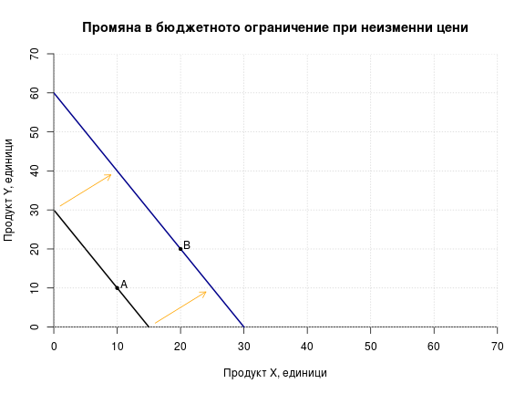
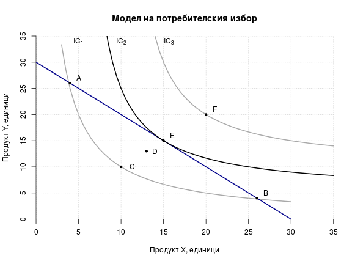

# Лекция 3. Еластичност на търсенето и предлагането. Потребителско поведение

## 1. Еластичност

### 1.1. Обща характеристика

__Еластичността__ показва чувствителността на количествената
промяна при настъпването на промяна в някаква друга величина.
Промяната в количеството може да бъде както на търсенето, така и
на предлагането, а промяната на другата величина може да бъде
цената на самия продукт, цената на друг продукт, или дохода.
Съпоставят се относителните промени във величините. 

### 1.2. Видове еластичност

#### 1.2.1. Еластичност на търсенето спрямо цената

Най-често се разглежда еластичността на търсенето спрямо цената и
именно тя щя бъде използвана за отправна точка при обяснението на
еластичността като понятие. На долната графика са показани две
криви с различна ценова еластичност на търсенето. При една и съща
промяна в цената изменението в търсеното количество е по-голямо
при крива 1, отколкото при крива 2, което означава, че и нейната
еластичност е по-голяма. Колкото по-стръмна е полегата е кривата,
толкова по-голяма еластичност отразява. Макар че двете криви се
различават по отношение на еластичността си, еластичността не се
запазва една и съща в рамките на една и съща крива. В горния край
на кривите, търсенето е по-еластично спрямо цената, отколкото в
долния им край (използвайте посочената по-долу формула и данните
от кривите, за да разберете сами защо).

 

Коефициентът на ценовата еластичност на търсенето се изчислява по
__формулата__:

$$E_{D_{P}}=\frac{\%\ Delta Q}{\% \Delta P}$$

Казано по друг начин, коефициентът на еластичност е равен на
отношението между процентното изменение на търсеното количество и
процентното изменение на цената. Представена по-подробно,
формулата изглежда по следния начин:

$$E_{D_{P}}=\frac{(Q_2-Q_1)/(Q_2+Q_1)}{(P_2-P_1)/(P_2+P_1)}$$

Тук P_1 и Q_1 са първоначалната цена и количество, а P_2 и Q_2 са
новата цена и новото търсено количество.

При изчисляването на коефициента на ценова еластичност на
търсенето винаги получаваме отрицателно число, което отразява
обратната зависимост между цена и търсено количество. Ние
игнорираме знака минус, тоест използваме модулната стойност на
получения резултат, за да правим по-нататъшно сравнение.

Ако Е>1, тогава е налице еластично търсене. Ако E<1, търсенето е
нееластично. При E=1 (частен случай, който е малко вероятен)
търсенето е с единична еластичност спрямо цената. Търсенето е
съвършено нееластично, ако E=0 и съвършено еластично, ако Е клони
към безкрайност. В първия от тези случаи изменението в цената не
води до никаква промяна в търсенето, а при втория - малки
изменения в цената водят до значителни изменения в търсенето
(леко повишение отказва напълно потребителите или леко понижение
ги стимулира да търсят цялата налична продукция). 

__Факторите__, оказващи влияние върху еластичността на търсенето
са:

* наличието или отсъствието на заместители. Колкото по-близки
  заместители има, толкова по-голяма е еластичността на търсенето
  спрямо цената;
* стоки, към които се привиква. Стоки като цигари и наркотици
  могат да създадат зависимост у потребителя до степен, в която
  той не вижда близки заместители у други стоки. При това
  положение търсенето ще бъде нееластично;
* дял на разходите за стоката в общите разходи на потребителя.
  Колкото по-малък е той, толкова по-нееластично ще бъде
  търсенето. Увеличаването му създава по-голяма тежест за
  потребителя, което го стимулира в по-голяма степен да промени
  потребителското си поведение;
* времеви период. Обикновено еластичността е по-голяма в по-дълъг
  период от време, защото позволява адаптирането на вкусовете и
  предпочитанията към други продукти или защото е по-вероятно да
  се появят стоки-заместители.

#### 1.2.2. Еластичност на предлагането спрямо цената

Графиката показва криви, отразяващи предлагане с различна
еластичност спрямо цената. И тук по-полегатата крива означава
по-еластично предлагане. 

 

Коефициентът на еластичност на предлагането спрямо цената се
намира при съотнасянето на процентното изменение в предлаганото
количество към процентното изменение в цената, която го е
породила. Формулата е следната:

$$E_{S_{P}}=\frac{\%\ Delta Q}{\% \Delta P}$$

Разширената формула за пресмятане на коефициента е същата както
при търсенето, с тази разлика, че вместо търсено количество, Q_1
и Q_2 в числителя ще се отнасят до предлагано количество.
Полученият коефициент в случая винаги ще бъде положителен, тъй
като отразява правата зависимост между цена и предлагано
количество. Съпоставката на коефициента и тук е спрямо единица.

#### 1.2.3. Еластичност на търсенето спрямо дохода

Еластичността на търсенето спрямо дохода показва колко
чувствително е търсенето при промени в дохода. Формулата за
пресмятането е следната:

$$E_{D_{Y}}=\frac{\%\ Delta Q}{\% \Delta Y}$$

Или записана разширено:

$$E_{D_{Y}}=\frac{(Q_2-Q_1)/(Q_2+Q_1)}{(Y_2-Y_1)/(Y_2+Y_1)}$$

В нея Y_1 и Q_1 са първоначалният доход и цена, а Y_2 и Q_2 са
доходът и цената след промените. 

За разлика от търсенето и предлагането, където знакът пред
коефициента е само един (съответно "-" или "+"), тук може да се
получи както отрицателен, така и положителен знак. Първият
показва, че става дума за малоценен продукт, а втория - за
нормален или луксозен (защото доходът и търсенето се изменят в
една и съща посока). При сравнението спрямо единица се използва
модулната стойност на коефициента.

#### 1.2.4. Кръстосана еластичност

Кръстосаната еластичност показва колко чувствително е изменението
в търсенето на един продукт, спрямо изменението на цената на друг
продукт.

$$E_{AB}=\frac{\%\ Delta Q_A}{\% \Delta P_B}$$

Във формулата Q_A е количеството от продукт А, а P_B е цената на
продукт B.

### 1.3. Значение на еластичността

#### 1.3.1. Значение при формирането на приходите на фирмата

При еластично търсене повишаването на цената от страна на фирмата
ще доведе до спад в получените приходи, а при понижаване на
цената - на увеличение на приходите. При нееластично търсене
увеличаването на цените води до повече приходи, а намаляването на
цените - до по-ниски приходи.

#### 1.3.2. Значение при данъчното облагане

Данъчната тежест се поема в по-голяма степен от този, чиято крива
е по-нееластична на долната графика това е производителя. Пазарът
първоначално е в равновесие в т. E_1 при цена от 5 лв.
Правителството решава да обложи производителя с данък от 2 лв. на
единица продукция. Това ще доведе до нарушаване на равновесието.
На практика данъкът оказва същия ефект като повишаването на
производствените разходи и измества кривата на предлагането
нагоре и наляво. Ако производителят иска да продава същото
количество като преди, получавайки цена от 5 лв., потребителят ще
трябва да плаща 7 лв. (от които 2 лв. прибира държавата като
данък). Но тогава ще се получи излишък, показан с червената
отсечка Q_D - Q_S. Приспособяването на пазара води до формирането
на ново равновесие в т. E_2 . Данъчната тежест е цялата
защрихована област на дясната графика, като тази в оранжев цвят е
тежестта, която се поема от прозводителя, а тази в зелено - от
потребителя. Тъй като търсенето е по-еластично от предлагането,
новата равновесна цена е нараснала много малко, в сравнение с
изходната позиция - от 5 лв. на 5,30 лв. и цената за
потребителите не е е увеличила много. Тъй като държавата
прибира 2 лв. от тези 5,30 лв. под формата на данъци, до
производителите достигат само 3,30 лв. Промяната за тях е много
по-голяма, отколкото за потребителите.

 


 

 

```
## png 
##   2
```

 

```
## png 
##   2
```


|Продукт X|Продукт Y|Полезност|
|---------|---------|---------|
| 3 бр.| 27 бр. | 50 ед. |
| 5 бр.| 17 бр. | 50 ед. |
| 7 бр.| 10 бр. | 50 ед. |
| 9 бр.| 7 бр.  | 50 ед. |
| 11 бр.| 4 бр. | 50 ед. |
| 13 бр.| 2 бр. | 50 ед. |
| 15 бр.| 1 бр. | 50 ед. |


 

 

 

 

 

 


 

 

```
## png 
##   2
```
