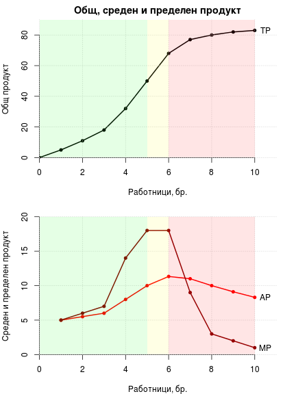

# Лекция 4. Производство на стоки и услуги

## 1. Производствени фактори

__Трудът__ е първичен производствен фактор. Той включва
физическите и психическите усилия, които изразходват хората при
създаването на блага, които задоволяват техните потребности.
__Земята__ също е първичен производствен фактор и включва всички
природни ресурси, които могат да се използват в производството -
земя, реки, езера, гори, полезни изкопаеми, слънчева енергия и
др. __Капиталът__ е вторичен фактор на производство. Това
означава, че за да бъде във вида, в който е, той е преминал
процес на преработка. Към него се включват инструменти, машини,
сгради - блага, в които вече има овеществен труд, които са
необходими за производството на други блага. Някои автори
извеждат като самостоятелна категория предприемачеството, но
други смятат, че то е специфична форма на труд.

## 2. Производство и време

От гледна точка на икономическия анализ в производството се
разграничават краткосрочен и дългосрочен период. Критерият за
това разграничение е степента на маневреност на факторите. При
наличието на поне един фиксиран (непроменян като количество)
фактор казваме, че правим анализ на производството в *краткосрочен
период*. При промяна на количеството от всички фактори, анализът
на производството е в *дългосрочен период*. Така че, когато правим
разграничението, нямаме предвид някакъв конкретен времеви интервал
- месец, година и т.н. Краткосрочният и дългосрочният период
варират от отрасъл до отрасъл и от фирма до фирма.  Значение има
единствено наличието или отсъствието на фиксирани фактори. Това
наличие или отсъствие на фиксирани фактори води до различни
закономерности в производството и решения, които взимат фирмите.

## 3. Производствена функция

*Производствената функция* показва каква е връзката между
използваните производствени фактори и получената крайна
продукция. Обикновено тя зависи от качеството на факторите,
използваната технология и организацията на производството.

Производствената функция има вида Q = f(K,L) , където Q е
получената продукция, К е количеството на вложения капитал, а L е
количеството труд. Функцията може да бъде разширена и да включва
земята, но обикновено се представя само с капитал и труд, което
прави анализа по-лесен. Според това как се отнася промяната на
използваните ресурси към промяната на крайната продукция
различаваме функция, отразяваща намаляваща, постоянна или
нарастваща *възвръщаемост от мащаба*. При намаляващата
възвръщаемост от мащаба увеличението на ресурсите е с по-голям
множител от увеличението на продукцията. Например ресурсите
растат 3 пъти, което води до увеличение на продукцията само 2
пъти. При постоянната възвръщаемост от мащаба увеличението на
ресурсите и на крайната продукция е с един и същи множител
(например 3 пъти за едното и за другото). Нарастващата
възвръщаемост от мащаба се наблюдава, когато увеличението на
ресурсите е с по-малък множител от увеличението на крайната
продукция (например 3 пъти за ресурсите и 5 пъти за продукцията).

Да разгледаме функцията Q=5KL . При 1 единица капитал и 1 единица
труд крайната продукция ще бъде равна на 5.1.1 = 5 единици. Ако
капиталът и трудът се увеличат два пъти продукцията ще бъде
5.2.2 = 20 единици. Ресурсите са се увеличили два пъти, а
продукцията - четири. Следователно тази производствена функция
показва производство с нарастваща възвръщаемост от мащаба. Ако
увеличим капитала и труда до четири единици, ще получим 5.4.4 =
80 и т.н.

Възвръщаемостта от мащаба се наблюдава в дългосрочен период. Това
се вижда от примера, който използвахме, защото променяхме
количеството на всички фактори в производствената функция и никой
от тях не беше фиксиран. Възможно е обаче да променяме само един
от факторите при неизменно количество от другия. Нека имаме
2 единици капитал и варираме броя на работниците от 1 до
3. Тогава във функцията Q=5KL ще имаме 5.2.1 = 10 единици
продукция, 2.2.2 = 20 единици продукция, 5.2.3 = 30 единици
продукция и т.н. В този случай не говорим за възвръщаемост от
мащаба, а за *пределна възвръщаемост* от продукта на променливия
фактор (в случая труда). Пределната възвръщаемост показва
как се изменя общата продукция при добавянето на една единица от
променливия фактор при неизменно количество от другия. В примера
вторият работник добавя 10 единици продукция (първоначално е била
10, а с неговото идване става 20). Третият работник също добавя
10 единици (продукцията се увеличава от 20 на 30). Това е тяхната
пределна възвръщаемост при фиксирано количество капитал от 2
единици. Пределната възвръщаемост може да бъде намаляваща,
постоянна или нарастваща. Каква е тя, се определя от съпоставката
на изменението в продукцията, която добавя всеки нов работник, с 
добавената продукция от работника преди него. В конкретния случай
тя е постоянна през цялото време, защото третият добавя колкото
втория, а вторият добавя колкото първия - по 10 единици. 

### 4. Закон за намаляващата възвръщаемост

При обяснението на закона за намаляващата възвръщаемост трябва да
се обърне внимание на две неща. Първо, отнася се до намаляващата
пределна възвръщаемост от физическия продукт на променливия
фактор при фиксирани други фактори. И второ, което е следствие от
първото, той се проявява само в краткосрочен период. В
дългосрочен период, тъй като се променят всички фактори, не
разглеждаме пределна възвръщаемост. Тогава може да се наблюдава
намаляваща, постоянна или нарастваща възвръщаемост от мащаба, но
каква е точно, зависи от конкретния отрасъл и технология и не се
наблюдава със силата на закон. В краткосрочен период винаги се
сблъскваме с намаляваща пределна възвръщаемост от физическия
продукт на променливия фактор, независимо от технологията или
отрасъла. Затова казваме, че в този период важи закона за
намаляващата пределна възвръщаемост.

Ще използваме следната таблица за илюстрация на този закон. Тя
показва как се изменя продукцията при зададено и неизменно
количество капитал и увеличение на броя на работниците. 
В случая L показва броя на работниците, TP (total product) -
общ продукт, MP (marginal product) - пределен продукт, a
AP (average product) - среден продукт. Средният продукт
показва какво количество продукция се пада на всеки работник, а
пределният продукт - какво количество продукция добавя всеки
нов работник към общата. Изчисляват се по формулите:

$$AP = \frac{TP}{L}$$

$$MP = \frac{\Delta TP}{\Delta L} = \frac{TP_2 - TP_1}{L_2 - L_1}$$

Във формулата за пределния продукт MP $L_1$ и $L_2$ са броя на
работниците преди и след тяхното увеличение, а $TP_1$ и $TP_2$ -
общата продукция преди и след увеличението на работниците.

| L     | TP    | MP    | AP    |
|------:|------:|------:|------:|
| 1     | 5.00  | 5.00  | 5.00  |
| 2     | 11.00 | 6.00  | 5.50  |
| 3     | 18.00 | 7.00  | 6.00  |
| 4     | 32.00 | 14.00 | 8.00  |
| 5     | 50.00 | 18.00 | 10.00 |
| 6     | 68.00 | 18.00 | 11.33 |
| 7     | 77.00 | 9.00  | 11.00 |
| 8     | 80.00 | 3.00  | 10.00 |
| 9     | 82.00 | 2.00  | 9.11  |
| 10    | 83.00 | 1.00  | 8.30  |

На таблицата различаваме три периода на пределна възвръщаемост от
продукта на труда. До петия работник включително наблюдаваме
нарастваща пределна възвръщаемост - вторият добавя повече
продукция от първия (6 единици вместо 5), третият добавя повече
от втория (7 единици вместо 6) и т.н. до петия, който добавя 18
единци. Шестият работник също добавя 18 единици и тъй като това е
точно толкова, колкото този преди него, говорим за постоянна
пределна възвръщаемост. Периодът на намаляващата пределна
възвръщаемост започва с добавянето на седмия работник, който
увеличава общата продукция само с 9 единици, осмият - само с 3 и
т.н. - всеки следващ работник добавя по-малко от предходния. 

Каква е причината за подобно движение на пределния продукт?
Допускаме, че всеки работник сам по себе си е толкова
производителен, колкото и другите, следователно е резултат от
някаква обективна закономерност в производството в кратосрочния
период. Първоначално наблюдаваме нарастваща пределна
възвръщаемост от физическия продукт на труда, защото малкото
работници не успяват да се възползват максимално от
възможностите, които предоставят наличните машини и инструменти
(които са фиксирано количество). Освен това прибавянето на нови
работници дава възможност за вътрешно разделение на труда в
рамките на самия производствен процес и повишаването на
производителността. При петия работник обаче ползите от
разделението на труда се изчерпват в рамките на съществуващия
капитал и шестият работник добавя точно толкова, колкото и този
преди него. Той е и последния, който успява напълно да използва
пълноценно машините и инструментите, които са на разположение.
Седмият и всеки следващ работник са ограничени във
възможностите си да допринесат за увеличаването на общата
продукция, понеже за тях няма достатъчно свободен капитал, който
да използват.

Така задължително се стига до намаляваща пределна възвръщаемост в
производството, която в краткосрочен период се проявява със
силата на закон - ограничеността на единия от факторите от един
момент нататък неминуемо води до спад в пределната
производителност на другия. Единственият начин да се избегне това
е с увеличаването и на капитала - ако седмият работник
получи допълнително машини и инструменти, той ще добави повече от
9 единици към общата продукция. Но тогава ще е налице промяна
във всички разглеждани фактори, което от позицията на
икономическия анализ означава, че производството е в дългосрочен
период.

Долната фигура периодът на нарастваща пределна възвръщаемост е
отбелязан със зелен, на постоянната пределна възвръщаемост - с
жълт, а на намаляващата пределна възвръщаемост - с червен цвят.
Когато е налице нарастваща пределна възвръщаемост общата
продукция се увеличава с ускорени темпове, при постоянната
пределна възвръщаемост - с постоянни темпове, а при намаляващата
увеличението е със забавени темпове.

 

