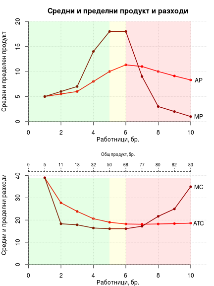
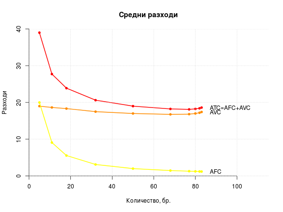
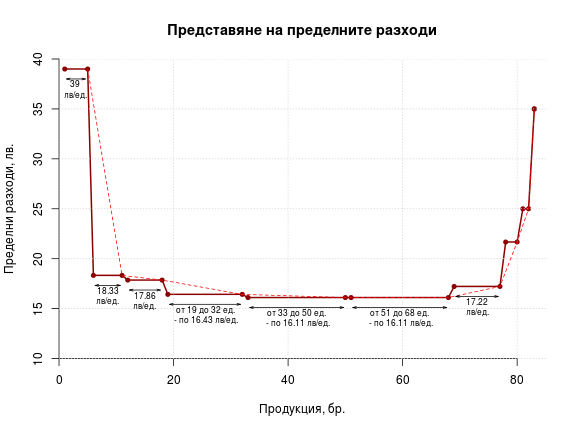
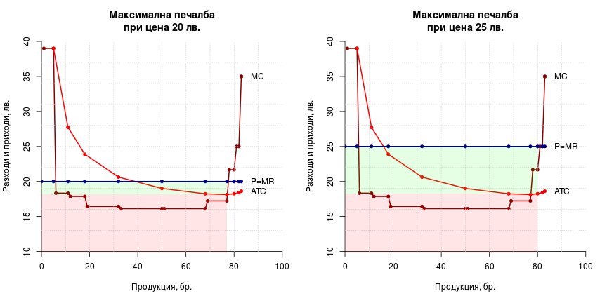

| L     | TP    | FC     | VC      | TC      |
|------:|------:|-------:|--------:|--------:|
| 1.00  | 5.00  | 100.00 | 95.00   | 195.00  |
| 2.00  | 11.00 | 100.00 | 205.00  | 305.00  |
| 3.00  | 18.00 | 100.00 | 330.00  | 430.00  |
| 4.00  | 32.00 | 100.00 | 560.00  | 660.00  |
| 5.00  | 50.00 | 100.00 | 850.00  | 950.00  |
| 6.00  | 68.00 | 100.00 | 1140.00 | 1240.00 |
| 7.00  | 77.00 | 100.00 | 1295.00 | 1395.00 |
| 8.00  | 80.00 | 100.00 | 1360.00 | 1460.00 |
| 9.00  | 82.00 | 100.00 | 1410.00 | 1510.00 |
| 10.00 | 83.00 | 100.00 | 1445.00 | 1545.00 |

 

 

 

|  работник  |  от кг  |  до кг  |  MC   |
|-----------:|--------:|--------:|------:|
| 1          | 1       | 5       | 39.00 |
| 2          | 6       | 11      | 18.33 |
| 3          | 12      | 18      | 17.86 |
| 4          | 19      | 32      | 16.43 |
| 5          | 33      | 50      | 16.11 |
| 6          | 51      | 68      | 16.11 |
| 7          | 69      | 77      | 17.22 |
| 8          | 78      | 80      | 21.67 |
| 9          | 81      | 82      | 25.00 |
| 10         | 83      | 83      | 35.00 |


```
##  [1] 39.00 39.00 18.33 18.33 17.86 17.86 16.43 16.43 16.11 16.11 16.11
## [12] 16.11 17.22 17.22 21.67 21.67 25.00 25.00 35.00 35.00
```

```
##  [1]  5 11 18 32 50 68 77 80 82 83
```

```
##  [1]  0  5 11 18 32 50 68 77 80 82
```

 

| L     | TP     | MP    | AP    | FC     | VC      | TC      | AFC   | AVC   | ATC   | MC    |
|-------|--------|-------|-------|--------|---------|---------|-------|-------|-------|-------|
| 1.00  | 5.00   | 5.00  | 5.00  | 140.00 | 95.00   | 235.00  | 28.00 | 19.00 | 47.00 | 47.00 |
| 2.00  | 11.00  | 6.00  | 5.50  | 140.00 | 205.00  | 345.00  | 12.73 | 18.64 | 31.36 | 18.33 |
| 3.00  | 18.00  | 7.00  | 6.00  | 140.00 | 330.00  | 470.00  | 7.78  | 18.33 | 26.11 | 17.86 |
| 4.00  | 32.00  | 14.00 | 8.00  | 140.00 | 560.00  | 700.00  | 4.38  | 17.50 | 21.88 | 16.43 |
| 5.00  | 50.00  | 18.00 | 10.00 | 140.00 | 850.00  | 990.00  | 2.80  | 17.00 | 19.80 | 16.11 |
| 6.00  | 70.00  | 20.00 | 11.67 | 140.00 | 1170.00 | 1310.00 | 2.00  | 16.71 | 18.71 | 16.00 |
| 7.00  | 93.00  | 23.00 | 13.29 | 140.00 | 1535.00 | 1675.00 | 1.51  | 16.51 | 18.01 | 15.87 |
| 8.00  | 116.00 | 23.00 | 14.50 | 140.00 | 1900.00 | 2040.00 | 1.21  | 16.38 | 17.59 | 15.87 |
| 9.00  | 132.00 | 16.00 | 14.67 | 140.00 | 2160.00 | 2300.00 | 1.06  | 16.36 | 17.42 | 16.25 |
| 10.00 | 142.00 | 10.00 | 14.20 | 140.00 | 2330.00 | 2470.00 | 0.99  | 16.41 | 17.39 | 17.00 |
| 11.00 | 147.00 | 5.00  | 13.36 | 140.00 | 2425.00 | 2565.00 | 0.95  | 16.50 | 17.45 | 19.00 |
| 12.00 | 150.00 | 3.00  | 12.50 | 140.00 | 2490.00 | 2630.00 | 0.93  | 16.60 | 17.53 | 21.67 |
| 13.00 | 152.00 | 2.00  | 11.69 | 140.00 | 2540.00 | 2680.00 | 0.92  | 16.71 | 17.63 | 25.00 |
| 14.00 | 153.00 | 1.00  | 10.93 | 140.00 | 2575.00 | 2715.00 | 0.92  | 16.83 | 17.75 | 35.00 |


 


| L     | TP    | P=AR  | TR      | MR    |
|-------|-------|-------|---------|-------|
| 1.00  | 5.00  | 20.00 | 100.00  | 20.00 |
| 2.00  | 11.00 | 20.00 | 220.00  | 20.00 |
| 3.00  | 18.00 | 20.00 | 360.00  | 20.00 |
| 4.00  | 32.00 | 20.00 | 640.00  | 20.00 |
| 5.00  | 50.00 | 20.00 | 1000.00 | 20.00 |
| 6.00  | 68.00 | 20.00 | 1360.00 | 20.00 |
| 7.00  | 77.00 | 20.00 | 1540.00 | 20.00 |
| 8.00  | 80.00 | 20.00 | 1600.00 | 20.00 |
| 9.00  | 82.00 | 20.00 | 1640.00 | 20.00 |
| 10.00 | 83.00 | 20.00 | 1660.00 | 20.00 |


|  работник  |  от кг  |  до кг  |  MC   |  MR  |  резултат от кг  |  резултат в интервала  |  общ резултат    | 
|-----------:|--------:|--------:|------:|-----:|-----------------:|-----------------------:|-----------------:| 
| 1          | 1       | 5       | 39.00 | 20   | -19.00           | -95                    | -95              | 
| 2          | 6       | 11      | 18.33 | 20   | 1.67             | 10                     | -85              | 
| 3          | 12      | 18      | 17.86 | 20   | 2.14             | 15                     | -70              | 
| 4          | 19      | 32      | 16.43 | 20   | 3.57             | 50                     | -20              | 
| 5          | 33      | 50      | 16.11 | 20   | 3.89             | 70                     | 50               | 
| 6          | 51      | 68      | 16.11 | 20   | 3.89             | 70                     | 120              | 
| 7          | 69      | 77      | 17.22 | 20   | 2.78             | 25                     | 145              | 
| 8          | 78      | 80      | 21.67 | 20   | -1.67            | -5                     | 140              | 
| 9          | 81      | 82      | 25.00 | 20   | -5.00            | -10                    | 130              | 
| 10         | 83      | 83      | 35.00 | 20   | -15.00           | -15                    | 115              | 


 

 
