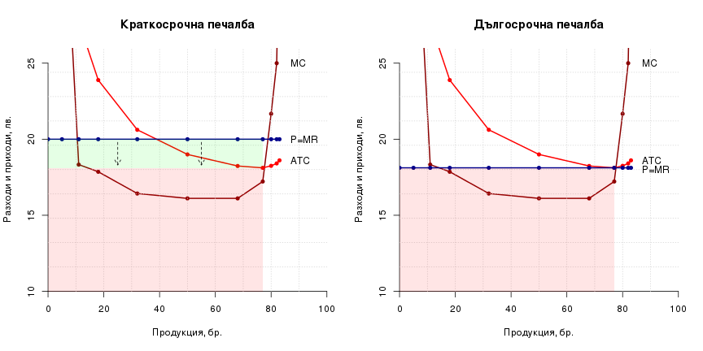
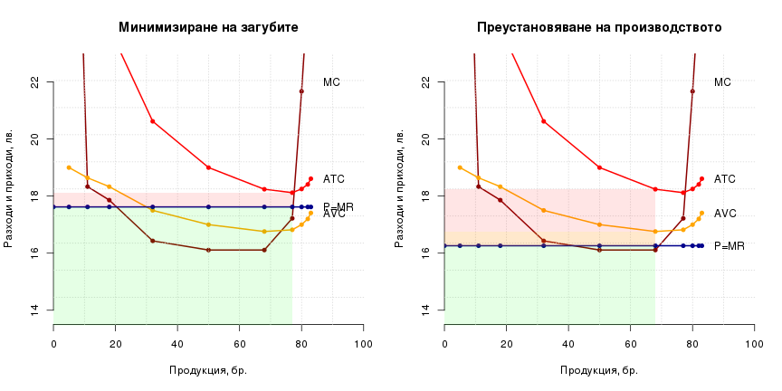
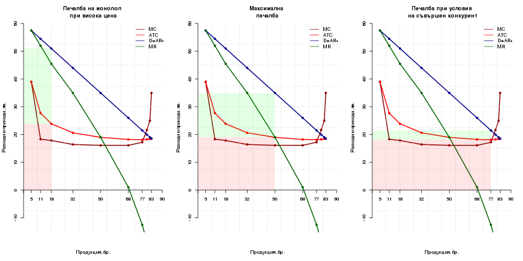
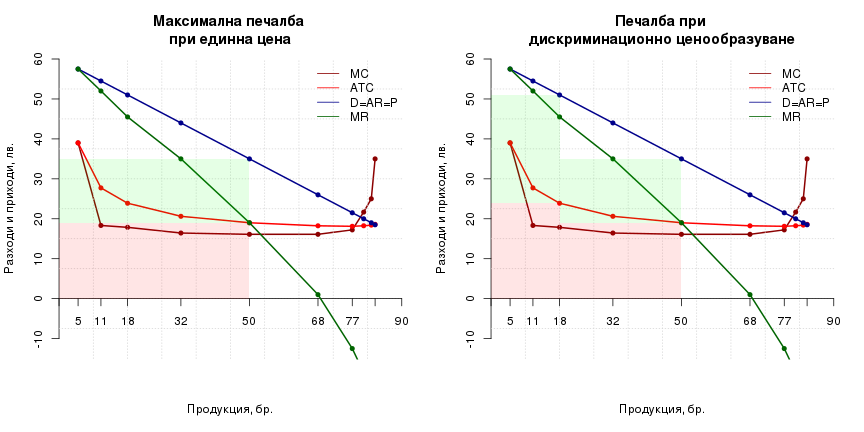
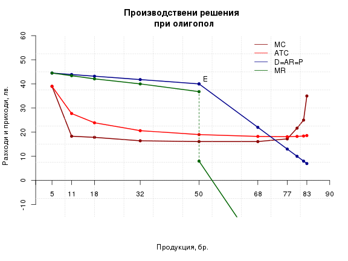

# Лекция 6. Конкуренция и пазарно поведение

## 1. Основни пазарни структури

На базата на броя на участниците на пазара, тяхната свобода да
навлизат и излизат от него, възможността им да влияят върху
цените, достъпа им до информация и характера на продуктите, които
произвеждат, могат да се обособят различни пазарни структури. При
всяка от пазарните структури конкурентният натиск върху отделната
фирма е различен. Разграничават се четири вида структури -
съвършена конкуренция, монопол, олигопол и монополистична
конкуренция. Първите две са повече теоретична абстракция и служат
като изходна точка на анализа. Последните две отразяват в много
по-голяма степен реалната среда, в която оперират фирмите. 

## 2. Съвършена конкуренция

### 2.1. Характеристика

За да е налице съвършена конкуренция, трябва да са изпълнени
следните условия:

* голям брой фирми и голям брой купувачи на техните продукти
* малък размер на фирмите
* безпрепятствено навлизане на и излизане от пазара
* хомогенни (идентични) продукти
* съвършена информация
* постоянна възвръщаемост от мащаба
* безпроблемна факторна мобилност
* нулеви разходи по сделките 

По отношение на броя и размера на фирмите няма строго определени
количествени критерии. Важното е никоя фирма да не бъде
достатъчно голяма, за да може да повлияе върху пазарната цена
като променя обема на произведената от нея продукция. Фирмите
приемат цената такава, каквато е на пазара. За тях няма проблем
да реализират цялото произведено количество по съществуващата
пазарна цена, независимо с колко променят обема на продукцията.
Те срещат *съвършено еластична крива на търсене*, която се
представя с хоризонтална линия. За фирма - съвършен конкурент
P=AR=MR.

### 2.2. Фирмени решения при съвършена конкуренция

Както вече беше показано в предишната тема, фирмата максимизира
печалбата там, където пределните разходи се изравнят с пределните
приходи (във възходяшата част на кривата на пределните разходи).
В случай, че не се постига равенство, печалбата е маскимална при
онзи обем на производството, където пределните приходи за
последно превишават пределните разходи. 

В краткосрочен период фирмата може да извлече печалба над
нормалната. Тя е показана в лявата част на графиката с оцветения
в зелено правоъгълник. При съвършената конкуренция обаче
свободният достъп до информация позволява на другите предприемачи
да научат, че печалбите в отрасъла са по-големи. При отсъствието
на бариери пред навлизането, това ще привлече нови фирми в него.
С това ще се увеличи отрасловото предлагане, което ще доведе до
спад в цената. Спадът в цената ще намали нормата на печалба. В
дългосрочен план фирмата - съвършен конкурент реализира приходи,
които ѝ позволяват да покрива разходите си (това е показано в
дясната страна на графиката). Ако цената падне до равнище, при
което за фирмите става невъзможно да покриват разходите си, някои
от тях ще излязат от отрасъла или ще прекратят дейността си и
така цената отново ще се повиши. В краткосрочен период отклонения
са възможни, но в дългосрочен цената се колебае около равнището
на средните разходи.

 
Не е задължително фирмата да преустанови производството при цена,
която е по-ниска от средните общи разходи. В лявата страна на
долната графика е показана ситуация, при която ATC>P>AVC. При това
положение фирмата реализира загуба, но целта ѝ е тя да бъде
минимизирана. Най-малка ще бъде загубата при производството на 77
единици продукция, тъй като там е последния случай, при който
MR>MC. Общите приходи (зелената област) са по-малки от общите
разходи (зелената + червената област) - загубата е отбелязана с
червен цвят. Въпреки, че работи на загуба, фирмата в случая покрива
променливите си разходи, затова е по-добре да продължи да работи.
При преустановяване на нейната дейност, загубите ще бъдат по-големи. 
Ако фирмата не може да покрива дори променливите си разходи
(ситуация, показана на дясната страна на графиката), е по-добре
да прекрати производството. Оцветената в червено област показва
размера на допустимата загуба, докато оранжевият правоъгълник 
показва загуба, която е сигнал за преустановяване на дейността.

Това може да се илюстрира със следния пример. Ако предприемач
финансира изграждането на хотел със заем, вноските по него са
постоянни разходи. Оперативните разходи по управлението на хотела - 
за заплати, за консумативи, за комунални услуги и т.н. са
непосредствено свързани с експлоатацията на хотела. Ако
предприемачът получава приходи, с които покрива тези оперативни
разходи напълно, но само частично заема си, той ще бъде на
загуба. Но все пак за него ще бъде по-добре да изплаща заема
частично, отколкото да не го изплаща изобщо, затова хотелът ще
продължи да работи. В случай, че не успява да покрива дори
оперативните си разходи, е по-добре да затвори хотела. Той не
само няма да е в състояние да обслужва заемите си, но ще е
принуден да използва финансови средства извън онези, получени от
приходите, за да осигури работата на хотела. При това положение
за него е по-добре да затвори хотела, за да не реализира
допълнитлено загуби от него (тук се допуска, че направената
инвестиция е невъзстановима).

 

## 3. Монопол

### 3.1. Характеристика

Както съвършената конкуренция, така и монополът са пазарни
структури, които съществуват повече на теория, отколкото на
практика. Все пак това важи в по-малка степен за монопола, при
който условията за съществуването му е по-лесно да бъдат
изпълнени. Монополът се характеризира с

* единствен производител
* производството на уникален продукт
* непреодолими бариери за навлизането на пазара (с изключение
  единствено на монополиста)
* ограничена информация

Тъй като монополистът е единствен производител, той среща
пазарната крива на търсене. Графично представена, това е кривата
на търсене с обратен наклон. Това означава, че фирмата не може да
реализира каквото количество пожелае при една и съща цена. Ако
желае да реализира по-голямо количество, ще трябва да го направи
при по-ниска цена. Ситуацията е показана на долната таблица. Ако
фирмата използва един работник, който произвежда 5 единици, тя ще
може да намери купувачи, които са склонни да дадат 57.5 лв. Но за
да реализира 11 единици на пазара (произведени от двама
работници), ще трябва да намали цената на 54.5 лв. и т.н.

| L, ед.|TP, ед.| D, лв.   | TR, лв.   | MR, лв.   |
|------:|------:|---------:|----------:|----------:|
| 1     | 5     | 57.5     | 287.5     | 57.5      |
| 2     | 11    | 54.5     | 599.5     | 52.0      |
| 3     | 18    | 51.0     | 918.0     | 45.5      |
| 4     | 32    | 44.0     | 1408.0    | 35.0      |
| 5     | 50    | 35.0     | 1750.0    | 19.0      |
| 6     | 68    | 26.0     | 1768.0    | 1.0       |
| 7     | 77    | 21.5     | 1655.5    | -12.5     |
| 8     | 80    | 20.0     | 1600.0    | -18.5     |
| 9     | 82    | 19.0     | 1558.0    | -21.0     |
| 10    | 83    | 18.5     | 1535.5    | -22.5     |
                                                    
Друга особеност, характерна за монопола, която се вижда от
таблицата, е разминаването между цената и пределните приходи.
Докато за фирма - съвършен конкурент P=MR=const., при монопола
P>MR, като и двете се изменят с количеството на продукцията.

### 3.2. Причини за съществуване на монопола

Причините за съществуването на монопола могат да бъдат
най-различни, като те обикновено са свързани с причините, поради
които други фирми не могат да навлизат на пазара. Тези причини
могат да бъдат *законови*, когато фирмата ползва патент,
позволяващ ѝ да бъде единственият производител на даден продукт.
Монополистът може да притежава и *единствено право на достъп и
контрол* върху суровини и ресурси. В определени случаи държавата
позволява на една единствена фирма да извършва определена
дейност по стратегически причини, например свързани с
националната сигурност. Не е задължително бариерите пред
навлизането да са законови. Възможно е фирмата да притежава
определено технически знания или информация, която ѝ дава
предимство, без непременно да се ползва със законова защита върху
тях. 

Друга причина за появата на монопол е наличието на големи
икономии от мащаба при ограничена поглъщаемост на пазара, което
прави неизгодно предлагането на стоката или услугата от много
фирми. Тогава нито една от тях няма да достигне обем, при който
производствените разходи са ниски. Въпреки конкуренцията между
тях, която води до по-малки печалби, те пак няма да са в
състояние да предлагат при по-ниска цена от една единствена
фирма. При нея печалбата ще е голяма, но заради икономиите от
мащаба, тя ще може да предлага на потребителите продукта при
по-ниска цена. В такава ситуация пазарните сили тласкат пазара
към монополизация. Когато естеството на стоката или услугата е
такова, че е най-изгодно тя да се предлага от един производител,
е налице *естествен монопол*. Това не означава, че всеки път,
когато фирмите се сливат и окрупняват, монополът е естествен.
Понякога това се прави умишлено от фирмите с цел по-добър контрол
върху пазара и изкуствено завишаване на печалбите. Сливанията
могат да бъдат както нагоре или надолу по производствената верига
(контрол върху суровини, дистрибуционна мрежа) - *вертикална
интеграция*, така и на същото равнище на производствената верига - 
*хоризонтална интеграция*.  

Понякога е трудно да се определи къде започва и къде свършва
монопола, което го прави повече теоретична конструкция, отколкото
реално съществуваща пазарна структура. Например дори да има само
една фирма, която доставя ток, за някои дейности потребителите
могат да намерят негови заместители (ако готвят на газ).

### 3.3. Равновесна цена и продукция при монопола

Монополистът може да избере цената, при която да предлага, или
количеството, което да предлага, но не и да контролира и двете
едновременно. На долната графика най-лявата фигура показва каква
е печалбата при избрана висока цена. Фирмата ще реализира печалба
(показана в зелено), но тя няма да бъде най-голямата възможна,
защото само малък брой потребители ще са склонни да закупят
стоката (голямата единична печалба не води непременно до голяма
обща печалба). На фигурата в средата е показана ситуация, при
която монополистът следва правилото MR=MC (или последната
единица, при която MR>MC). Това е максималната печалба, която
може да бъде получена. Най-дясната фигура показва каква би била
печалбата на монополиста, ако той спазваше това правило и освен
всичко MR бяха равни на P, както е при фирма - съвършен
конкурент. Тогава печалбата за монополиста щеше да бъде по-малка,
а потребителят щеше да получава повече продукция при по-ниска
цена.

 
Всъщност монополистът е в състояние да увеличи допълнтелно
печалбата си, ако е успее да сегментира пазара и да предлага
продукта при различни цени за различните потребители. Това се
нарича *дискриминационно ценообразуване* и е показано на долната
графика. 

 

### 3.4. Последици от съществуването на монопола

Както бе показано по-горе, при монопол потребителите получават
по-малко количество при по-висока цена, отколкото при съвършена
конкуренция. Това води до загуба в тяхното благосъстояние. В
динамика монополът води до застой и липса на иновации, поради
липсата на конкурентен натиск. От друга страна обаче възможността
за извличане на монополни печалби често е стимул за фирмите да
иновират с надеждата да открият технологии или продукти, които
само те могат да предлагат. 

Въпреки всичко в повечето случаи правителството се опитва да
ограничи негативните ефекти от монополите. За тази цел то може:

* да разбие монопола на няколко по-малки фирми
* да придобие собственост върху монопола като по този начин
  осигури извънпазарни канали за контрол върху неговата дейност
* да регулира фирмата монополист. Тук са налице две основни
  стратегии - да се определи норма на печалба или да се въведе
  ценови таван на услугата. Първият вариант може по-лесно да бъде
  заобиколен, като фирмата изкуствено завишава разходите си.
  Вторият вариант, от друга страна, стимулира фирмата да иновира
  и да намалява разходите си, защото това би означавало по-голяма
  печалба за нея.
* да се създадат условия за т.нар. оспорвани пазари - дори да е
  изгодно продуктът да се предлага само от една фирма,
  съществуват условия за навлизането на нови, които принуждават
  фирмата да не се държи като монополист. За тази цел обаче
  трябва да са изпълнени някои условия, например дейността да не
  се съпътства от невъзстановяеми разходи.

## 4. Монополистична конкуренция

Монополистичната конкуренция прилича до голяма степен на
съвършената конкуренция. Това, по което се различава, е
характерът на предлаганите продукти. Основните черти на
монополистичната конкуренция са:

* голям брой малки фирми
* свобода пред навлизането и излизането на пазара
* безпрепятствено движение на производствените фактори
* нулеви разходи по сделките
* хетерогенни (диференцирани) продукти.

Разликата се състои в това, че при монополистична конкуренция
фирмите предлагат сходни, но въпреки това различни продукти,
което им дава известен контрол върху съответната пазарна ниша.
Фирмите в отрасъла срещат крива на търсенето, която е с обратен
наклон, но тя е по-полегата отколкото при чистия монопол, което
показва, че нямат пълен контрол върху цените. По-голямата част от
стоките и услугите се продават в условията на такава пазарна
структура. При монополистичната конкуренция ролята на рекламата и
други форми за привличане на клиенти е много голяма. Фирмите
рядко се конкурират ценово.

## 5. Олигопол

Характерните черти на олигопола са:

* малък на брой големи фирми
* взаимозависимост на фирмите
* бариери пред навлизането и/или излизането в отрасъла

Предлаганите продукти могат да бъдат както хомогенни, така и
диференцирани. Бариерите в повечето случаи са подобни на тези при
монопола, но се проявяват с по-малка сила. Често олигополът е
резултат от наличието на икономии от мащаба.

Характерна за олигипола е т.нар. ексцентрична (пречупена) крива на
търсенето, която срещат фирмите при тази пазарна структура. Тя
отразява тяхната взаимна зависимост. Обикновено се формира една
стабилна цена и рядко настъпват отклонения в нея. При олигополна
структура фирмите обикновено се конкурират неценово, макар
ценовата конкуренция да не е изключена. Промените в цената не
водят до  голяма изгода за фирмата. При изходна точка Е на
долната графика (точка на ценова стабилност) фирмата може да
повиши цената, което ще доведе бързо до голяма загуба на клиенти
(което и обяснява слабият наклон на кривата в горната ѝ част).
Ако фирмата вземе решение да намали цената, за да привлече
клиенти, нейните конкуренти ще направят същото, за да не изгубят
клиенти (заради което долната част на кривата е с по-стръмен
наклон). В крайна сметка никоя фирма няма да има повече клиенти,
но всички ще продават при по-ниски цени (и печалби). Поради тази
причини фирмите при олигопол рядко се конкурират ценово.

 

## 6. Измерване на концентрацията на пазара 

Концентрацията на пазара се изплзва чрез индекса на Херфиндал.
Той се изчислява като сумата от пазарните дялове на всяка от
фирмите, представени в проценти и повдигнати на квадрат. Колкото
по-голяма е стойността, толкова по-голяма е концентрацията на
пазара. Максималната стойност е 10 000, което е налице при една
единствена фирма. Ако имаме три фирми с дялове 70%, 20% и 10%,
индексът ще бъде 70^2 + 20^2 + 10^2 = 5400. 
