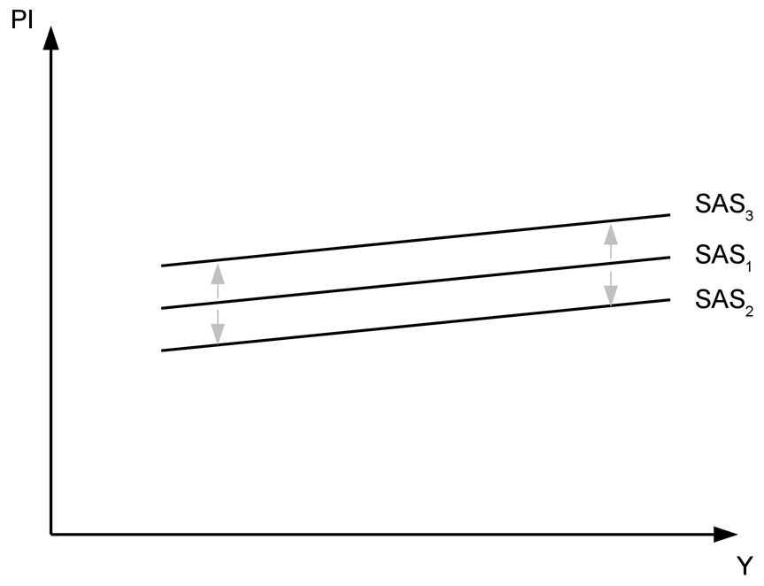
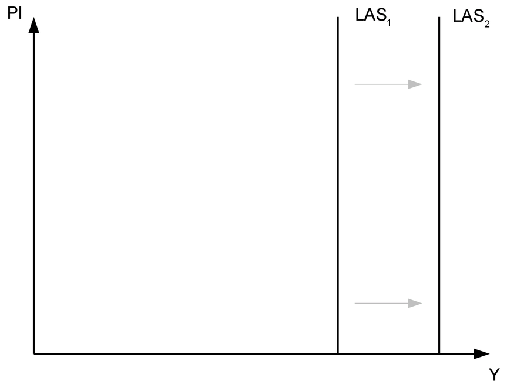
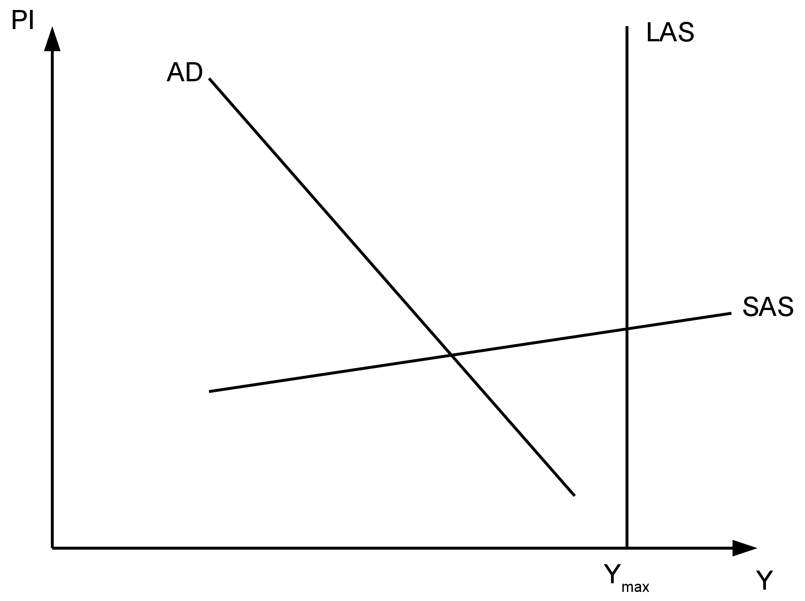
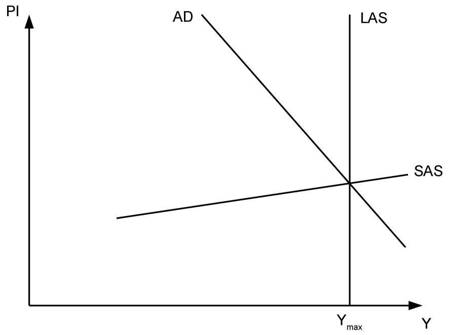
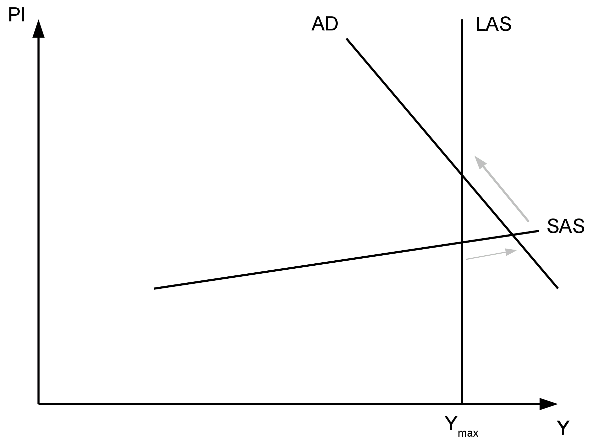
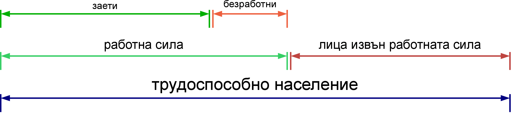
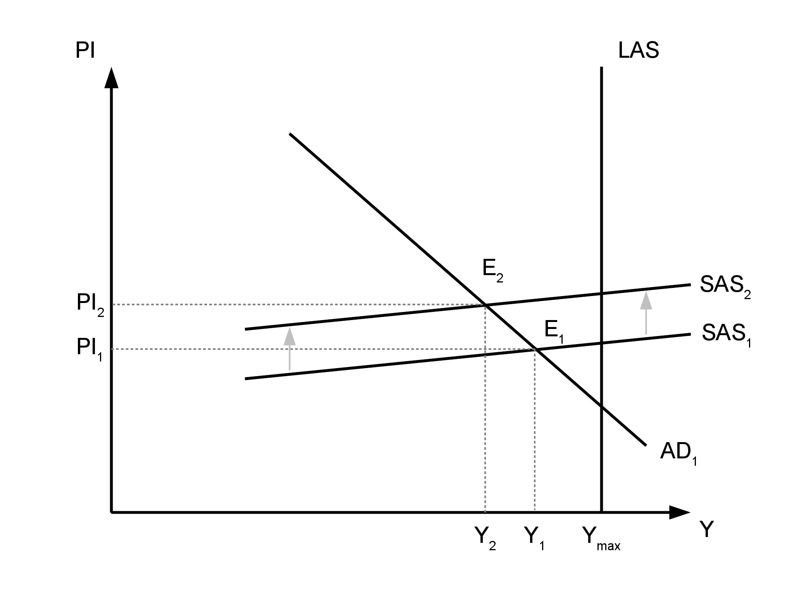
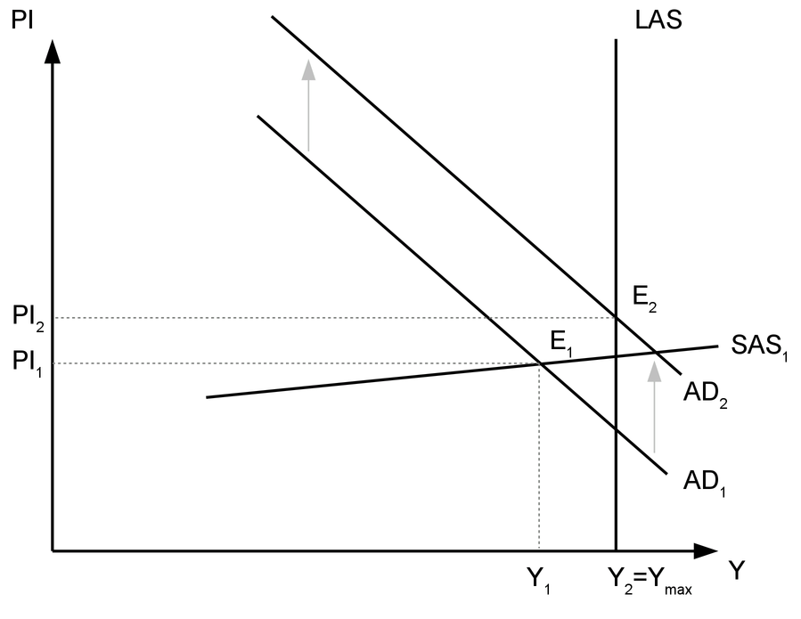
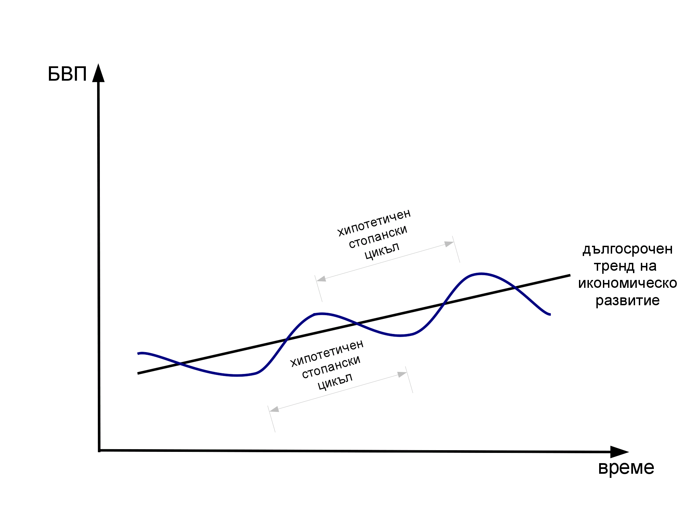

```{r global_options, include = FALSE}
knitr::opts_chunk$set(fig.width = 8, fig.height = 6,
                      fig.path = "figure/",
                      #dev='cairo_pdf',
                      echo = FALSE, warning = FALSE, 
                      message = FALSE)
```

# Макроикономическо равновесие. Безработица, инфлация и стопански цикъл 

## 1. Макроикономическо равновесие

### 1.1. Съвкупно търсене

Съвкупното търсене показва какво е общото количество стоки и
услуги, което населението на дадена страна желае и може да закупи
при съответното ценово равнище. Съществува обратна зависимост
между ценовото равнище и търсеното количество на стоките и
услугите. Тя се обуславя от факта, че при равни други условия
по-високо ценово равнище означава по-ниска покупателна способност
на населението. 


Кривата на съвкупното търсене (AD) може да се измести нагоре или
надолу при настъпването на определени промени. Съвкупното търсене
може да се повлияе от:

* __паричната маса__ - при равни други условия повече пари
в обращение ще стимулират търсенето, а по-малко - ще го намалят
* __лихвения процент__ - увеличението на лихвения процент
стимулира спеставанията, съответно намалява търсенето; обратно
при неговото намаление
* __валутния курс__ - обезценката на местната валута прави местните
стоки по-привлекателни за чужденците, което води до повишаване на
търсенето; обратно при поскъпването ѝ
* __очакванията за инфлацията__ - очакванията за висока инфлация след
време стимулират търсенето в текущия период
* __очакванията за стопанския цикъл__ - при положителни очаквания за
развитието на икономиката съвкупното търсене ще се повиши, защото
населението очаква повишаване и на доходите си в един бъдещ
период; при негативни очаквания съвкупното търсене ще се намали,
защото хората ще предпочетат да спестят средства за посрещането
на нуждите си, когато доходите им са по-ниски
* __данъци__ - по-високите данъци оставят по-малко средства за
харчене у домакинствата и фирмите.


### 1.2. Съвкупно предлагане

Съвкупното предлагане показва какво е общото количество стоки и
услуги, което желаят и могат да предложат фирмите при съответното
ценово равнище. Прави се разграничение между съвкупното
предлагане в краткосрочен и в дългосрочен период.

__Съвкупното предлагане в краткосрочен период (SAS)__ показва права 
зависимост между ценовото равнище и общото количество стоки и
услуги. Краткосрочното съвкупно предлагане се изменя при
изменения в цените на производствените ресурси. При равни други
условия поскъпването им води до спад в предлагането, а
поевтиняването им - до увеличение. Това са промени, които се
осъществяват при зададено технологично, образователно и културно
равнище, население и капиталови наличности. Тоест промените в
кратксрочното съвкупно предлагане са промени в рамките на
съществуващия производствен капацитет на националната икономика. 




__Съвкупното предлагане в дългосрочен период (LAS)__ не зависи от
измененията в ценовото равнище, затова графично се представя като
вертикална права. Всъщност тази крива представлява границата на
производствените възможности на националната икономика, когато
съществуващите производствени ресурси се използват напълно.
Изместването на кривата на дългосрочното предлагане е възможно
при промяна в населението или капиталовите запаси, а също при
развитие на технологиите, промени в образованието и
квалификацията, ценностите и нагласите и други. Тези промени
водят и до промени в производствения капацитет на националната
икономика. 



### 1.3. Макроикономическо равновесие

Макроикономическото равновесие е налице тогава, когато съвкупното
търсене и съвкупното предлагане са равни. Тогава цялото
количество произведени стоки и услуги в националната икономика
намира своята пазарна реализация. Според това къде се формира
равновесието по отношение на производствения капацитет на
националната икономика (тоест, къде се пресичат кривите AD и SAS
спрямо LAS) се наблюдават три възможни ситуации:

* макроикономическо равновесие при непълна заетост - равновесието
се формира в ситуация, при която не се използват всички
съществуващи производствени ресурси



* макроикономическо равновесие при пълна заетост - оптималното от
гледна точка на развитието на икономиката равновесие



* макроикономическо равновесие отвъд пълната заетост - то е
възможно за сравнително кратък период, когато при пределна
мобилизация в производството се включат ресурси, които по принцип
не биха участвали в него. Впоследствие обаче производството ще се
възстанови на равнището на пълна заетост, но при по-високо ценово
равнище. 



## 2. Безработица

### 2.1. Измерване на безработицата

За измерването на безработицата и другите свързани с нея
показатели трябва да се направи разграничение между различните
групи хора според отношението им към пазара на труда. Те са
показани на следната схема:



Лицата, които са навършили определена възраст и са физически и
психически годни да работят, формират *трудовите ресурси* на една
страна. Тоест, това са хората, които могат да работят. Тази група
се разделя на две. Тези, които могат да работят и желаят да
работят формират *работната сила* (икономически активното
население). Лицата, които могат да работят, но поради някаква
причина не желаят да го правят в момента, са *лица извън
работната сила* (текущо икономически неактивно население). Според
официалната статистика *заети* са лицата на 15 и повече навършени
години, които извършват работа срещу заплащане (или временно
отсъстват от нея). *Безработни* са лицата на 15 и повече
навършени години, които нямат работа, но активно си търсят. 

Следователно не всеки, който не работи, е безработен. Безработни
са само онези хора, които нямат работа, но желаят да работят. При
това желанието трябва да бъде изразено активно чрез действия,
които показват, че е така. Измерването на безработицата и
другите показатели за състоянието на пазара на труда се
осъществява от Националния статистически институт посредством
провеждането на анкетни проучвания, които обхващат почти 20 000
домакинства на територията на цялата страна. На базата на събраните 
данни се прави извод за състоянието на пазара на труда като цяло.  

Публикуват се следните показатели:

*Коефициент на икономическа активност* - относителен дял на
икономически активното население от населението на същата
възраст.

*Коефициент на заетост* - относителен дял на заетите лица от
населението на същата възраст.

*Коефициент на безработица* - относителен дял на безработните лица
от икономически активното население (работната сила).


Ако безработните са например 300 000 души, а заетите са 2 700 000
души, коефициентът на безработица се изчислява като 

$$\frac{300000}{300000+2700000} \times 100\% = 0.1 \times 100\% = 10\% $$

### 2.2. Видове безработица

Има три основни вида (форми) на безработицата според причините за
нейното съществуване. Първият вид е **текущата**. Тя е резултат
от непрекъснатото движение на работната сила. Винаги има хора,
които напускат работната сила и такива, които се включват в нея.
Също така винаги има хора, които са в процес на смяна на работата
по свои лични причини. Този процес е неизбежен и тази безработица
никога не може да бъде премахната. Възможно е обаче да се намали
размерът ѝ чрез подобряване на информационното осигуряване (за
това какви работни места се предлагат и търсят), а също и чрез
промени в трудовото законодателство. Вторият е **структурната**,
която е резултат от несъответствието между изискванията на пазара
на труда и квалификацията на работната сила. Тя е резултат от
развитието на технологиите, а понякога и от големи
институционални промени (например преимнаването то планова към
пазарна икономика). Подобно на текущата и структурната
безработица е постоянен спътник на икономиката. Тя може да бъде
намалена с провеждането на курсове за преквалификация.
**Цикличната** безработица е единствената, която може да бъде
премахната напълно, макар и само за определени периоди от време.
Циклично безработните са хората, които остават без работа, когато
икономиката се намира в низходящите фази на стопанския цикъл. Тя
е следствие от свитото съвкупно търсене и мерките, които могат да
се предприемат срещу нея са свързани с провеждането на фискалната
и монетарната политика.

### 2.3. Пълна заетост

Пълната заетост не означава, че работят всички. Пълната заетост
е заетост при т.нар. *естествена норма на безработица*, която
включва текущата и структурната безработица. 

## 3. Инфлация

Инфлацията е процес на покачване на общото ценово равнище, при
което намалява покупателната сила на паричната единица. 

### 3.1. Измерване на инфлацията

Инфлацията се измерва с нейния темп. Темпът на инфлацията се
изчислява като относителния прираст в някой от ценовите индекси.
Това става по формулата:

$$\frac{It_1-It_0}{It_0} \times 100\% $$, 

където 

$It_1$ - индекс на цените през текущия период  
$It_0$ - индекс на цените през базовия период

Използваните индекси могат да бъдат

* Индекс на потребителските цени - ценови индекс на най-често
употребяваните стоки и услуги от едно средностатистическо
домакинство. Това е официалният измерител на инфлацията в
България
* Индекс на цени на производител - краткосрочен икономически
показател, измерващ средното изменение на цените на промишлените
продукти, произвеждани и продавани от българските предприятия на
базата на постоянна извадка от групи продукти. Включва основно
продукти за междинно потребление и инвестиционни продукти
* Дефлатор на БВП - индекс на цените на всички крайни стоки и
услуги

### 3.2. Видове инфлация

* умерена - до 10% на годишна база
* галопираща - 20%-200% на годишна база
* хиперинфлация - над 50% на месечна база

Възможно е да се наблюдава спад в общото ценово равнище,
съпроводено с повишаване на покупателната сила на парите. Тогава
е налице *дефлация*.

### 3.3. Последствия от инфлацията

Ниските равнища на инфлация не са непременно проблем за
икономиката. Според някои автори те дори са полезни, защото
стимулират потреблението и икономическата активност. Проблемите
настъпват с увеличаването на темповете на инфлацията до
двуцифрени стойности на годишна база. Дори тогава те са причинени
повече от това, че изменението в цените е различно за различните
стоки и услуги и е трудно да се предвиди какви точно ще бъдат те.
Това води до нарушаване на стопанските пропорции и увеличаване на
несигурността в стопанската среда. Като следствие
предприемаческият хоризонт се скъсява и инвестициите се
пренасочват в по-бързооборотни начинания. При много високи
темпове на инфлацията паричната единица може да загуби функцията
си на разменно средство и да се премине директно към натурална
размяна, което изключително затруднява икономическа дейност от
всякакъв характер. 

Макар че високите темпове на инфлация като цяло имат негативни
последици за обществото, определени лица могат да спечелят от
нея. За кредиторите инфлацията означава спад в реалната стойност
на дълга. За да се предпазят от обезценката на задълженията,
кредиторите могат да заложат в договор индексация на номиналния
лихвен процент с темпа на инфлация (реалният лихвен процент е
равен на номиналния минус темпа на инфлация). Дори това обаче не
е достатъчно ефективна стратегия при хиперинфлация, когато
индексацията на лихвения процент може да не се осъществява
достатъчно бързо, за да компенсира обезценката на парите.

Дефлацията също има своите недостатъци. Когато спадът в ценовото
равнище се трансформира в очаквания за продължаващ спад в цените,
хората отлагат покупката на стоки и услуги. Това води до
затруднения в реализацията на продукцията, съответно до спад в
производството, за да се приведе то в съответствие със спадналото
търсене и до намаляване на заетостта. Освен това дефлацията е
свързана с повишаване на реалния лихвен процент и оскъпяване на
заемите, което прави реализирането на инвестиции със заемни
средства по-трудно.

### 3.4. Причини за инфлацията

* инфлация, породена от поскъпване на основни суровини и продукти
(cost-push inflation)



Тази инфлация, която понякога се нарича инфлация, породена от
шокове в предлагането, е причинена от поскъпването на основни
суровини или продукти, които са ценообразуващ фактор за голяма
част от стоките и услугите, които се произвеждат в икономиката.
Такива например са горивата. Възможно е този вид инфлация да бъде
причинена и от повишаване на работната заплата над онова ниво,
което съответства на производителността на труда. Появата на този
вид инфлация е свързано с изместване на кривата на краткосрочното
съвкупно предлагане нагоре и надясно, което води до формирането
на ново макроикономическо равновесие при по-високо ценово равнище
и по-ниска зетост и национален доход.

* инфлация, породена от прекомерно увеличение на съвкупното
търсене (demand-pull inflation)



Този вид инфлация се наблюдава, когато съвкупното търсене е
толкова голямо, че фирмите не могат да отговорят с увеличаване на
производството, защото повечето от тях са достигнали капацитета
на производствените си възможности, като същевременно не могат да
привлекат нови ресурси в производството. Националната икономика
работи на равнището на пълна заетост и повишаващото се търсене
намира отражение единствено в увеличение на общото ценово
ранвище. Тази ситуация е позната като "прегряване" на
икономиката.

* инфлацията като паричен феномен ($M \times V = P \times Q$)

Според някои икономисти инфлацията е единствено и изцяло паричен
феномен. Инфлацията на предлагането и на търсенето, описани
по-горе, са само краткотрайни явление и не могат да се установявт
трайно без повишаване на паричната маса. В горното уравнение
(т.нар. количествено уравнение)

M - количество на парите  
V - скорост на обръщение на парите  
P - ценово равнище  
Q - количество на произведените стоки и услуги

V обикновено е постоянна за дълги периоди от време и промени в
нея настъпват при технически нововъведения (например въвеждането
на банкоматите), Q се изменя трудно и със сравнително малко (в
един по-кратък период). Тогава промяната в паричната маса M се
поема почти изцяло от ценовото равнище P. Докато за инфлацията на
търсенето и на предлагането може да се спори дали непременно се
съпътстват от промяна в паричната маса, то за хиперинфлацията със
сигурност може да се каже, че е изцяло паричен феномен.  

## 4. Цикличност на икономиката - стопански цикъл

### 4.1. Определение. Фази на стопанския цикъл

Движението на икономиката за повечето страни е възходящо в един
по-дълъг период от време. Това е показано на графиката с правата
линия на тренда на икономическо развитие. Всъщност това движение
нагоре не е плавно и постъпателно, а минава през определения
колебания. Именно тези колебания в стопанската активност формират
стопанския цикъл. За по-доброто му анализиране може да разгледаме
един *хипотетичен стопански цикъл*.  Хипотетичният стопански
цикъл включва колебанията на стопанската активност, при които
няма повторение в посоката на движение на основните
макроикономически показатели. Тоест, той включва периода от дъно
до дъно или от връх до връх и обхваща всички фази на цикъла.
Най-общо фазите са две - низходяща и възходяща, като според някои
автори низходящата включва криза и рецесия, а възходящата -
оживление и подем. Кризата и рецесията са съпътствани
от спад в производството, заетостта и цените. Официалното
определение за рецесия е, че тя е налице при спад на БВП в две
последователни тримесечия. При оживлението и подема
производството и заетостта се увеличават, наблюдава се и леко
повишение в ценовото равнище. За началото на подема се смята
достигането на най-високата предкризисна точка на БВП. Трябва да
се отбележи, че тези промени съпътстват фазите на стопанския
цикъл от неговата поява в началото на 19 век до Втората световна
война. След това низходящите фази на стопанския цикъл често са
съпътствани не от спад, а от повишение в общото ценово равнище.
Така в следвоенната икономика се появява понятието *стагфлация*,
която се характеризира със стагнация на икономическата дейност и
висока инфлация. Причината за тези различия е свързана с
различните парични режими преди и след Втората световна война.
Преди нея в повечето страни е възприета някаква разновидност на
златния стандарт, при който стойността на паричната е фиксирана
към златото, което прави провеждането на монетарна политика
по-трудно. След това златният стандарт е изоставен, а централните
банки предприемат по-активна парична политика по време на криза,
което често е свързано с увеличение на паричната маса и ценовото
равнище.  



### 4.2. Причини за цикличността

Според кейнсианската икономическа школа кризите в стопанския
цикъл са причинени от спадове в съвкупното търсене. Според
монетаристите колебанията в икономическата активност са
предхождани от колебания в паричната маса. Някои икономисти
търсят причините за стопанския цикъл в кредитните цикли, при
които поддържането на ниски лихвени проценти води до
разширяването на инвестициите и образуването на спекулативни
балони, които в крайна сметка се оказват неустойчиви, а това води
до криза и невъзможност за възстановяване на някои от
инвестициите. Според представителите на школата за реалния делови
цикъл кризите в икономиката са естествено следствие от
приспособяването на икономиката към шокове, свързани
с появата на технологически или организационни нововъведения.
Някои автори намират връзка между електоралния цикъл и
стопанските цикли, тъй като преди избори управляващите са склонни
да харчат повече, за да повишат икономическата активност и да
спечелят избиратели.
