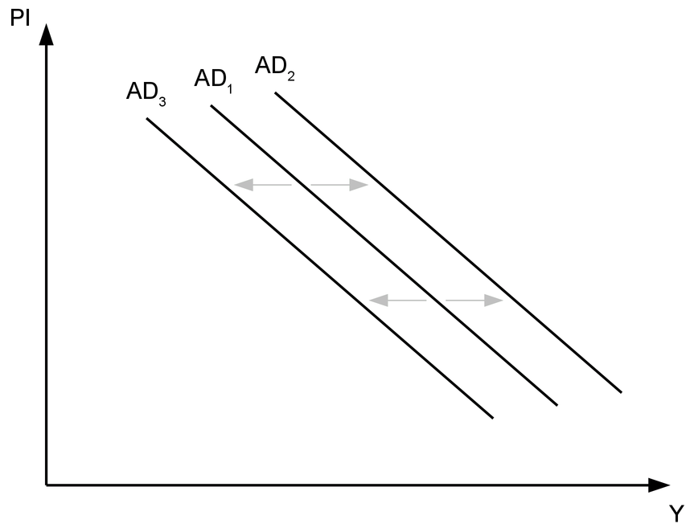
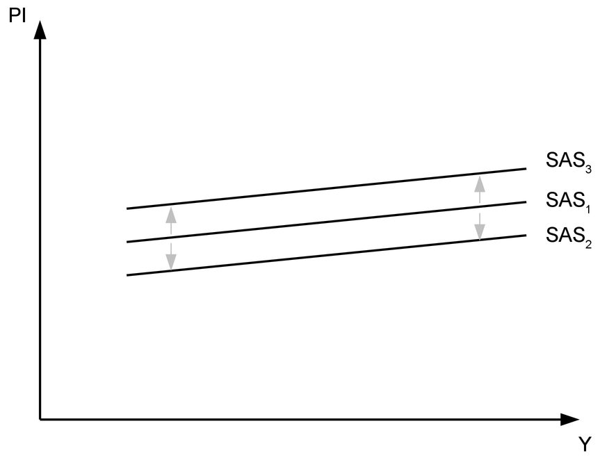
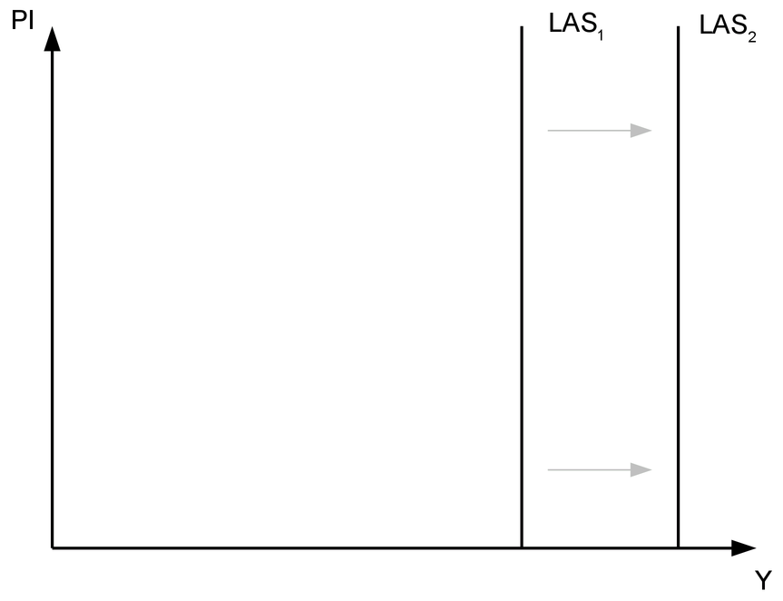
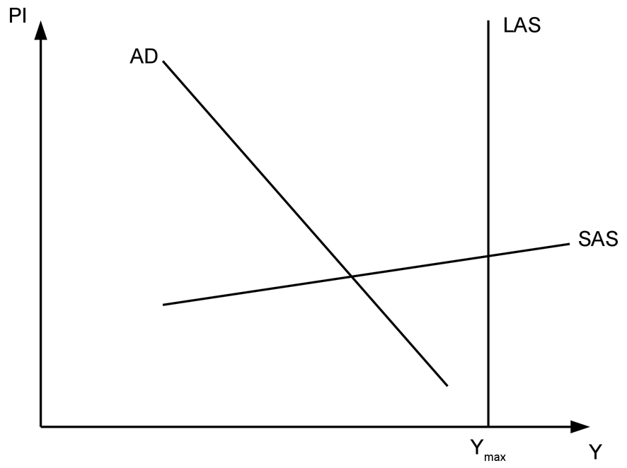
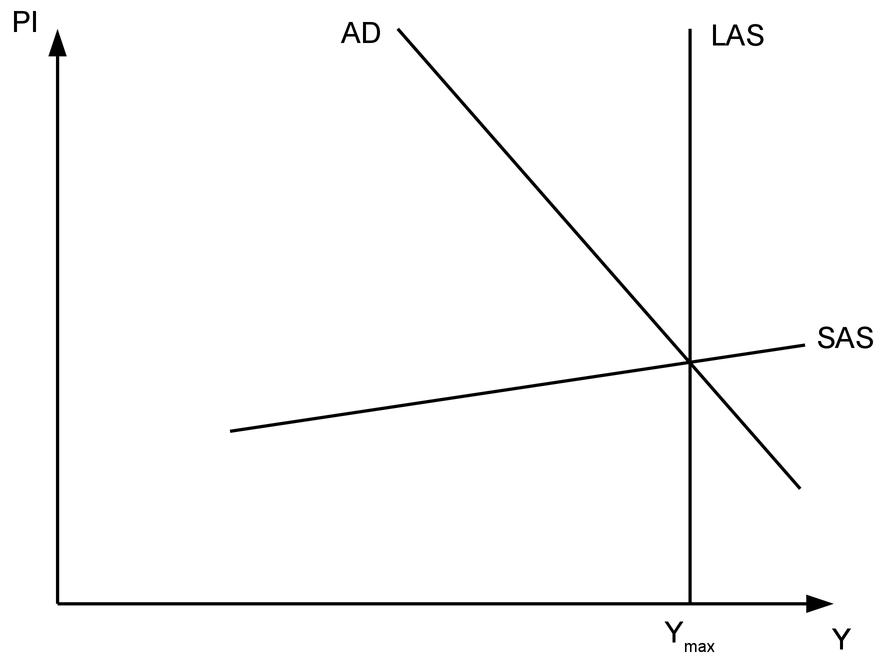
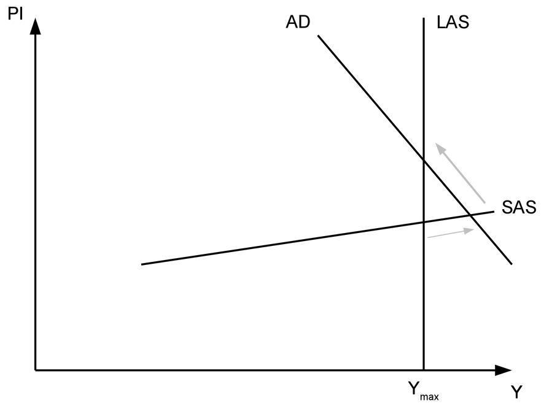
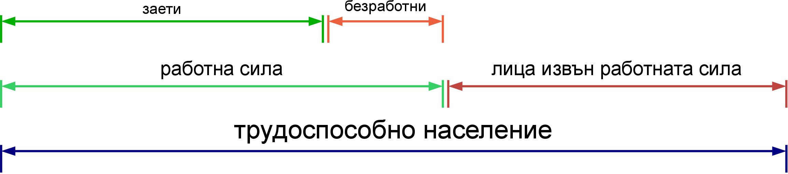
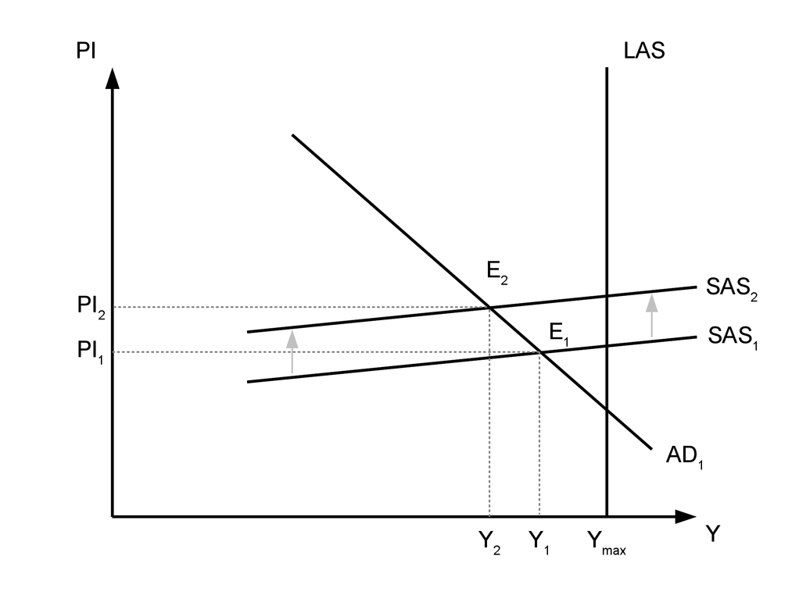
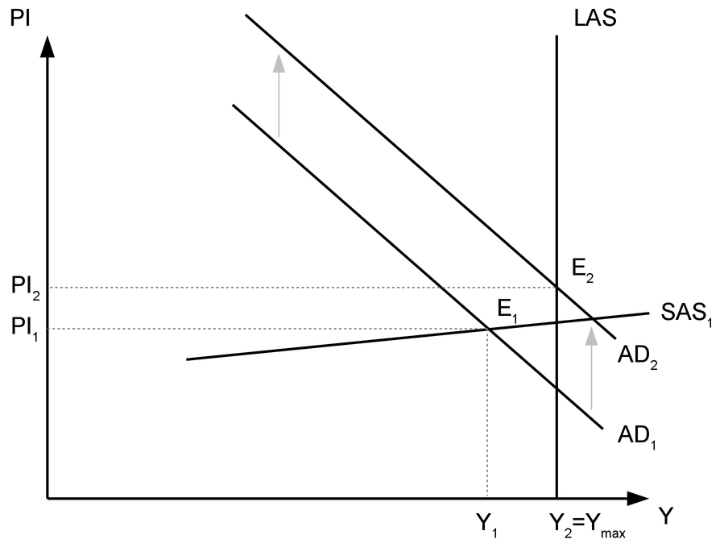
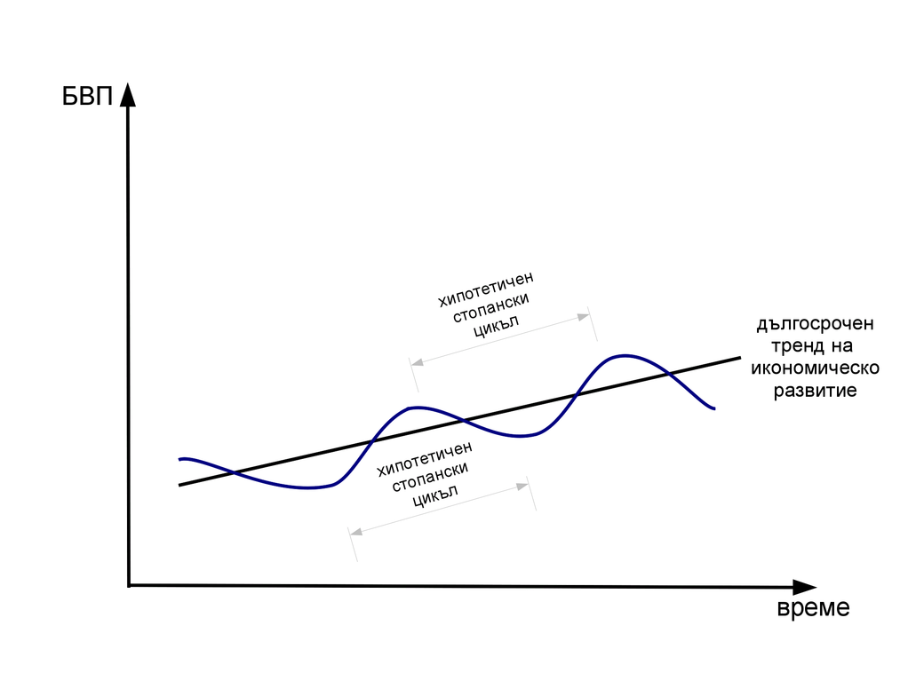

title: "Макроикономическо равновесие. Безработица, инфлация и стопански цикъл"
author: "Александър Косулиев"
date: "22.11.2015"
output: 
  pdf_document: 
    toc: yes
    toc_depth: 3
    latex_engine: xelatex
mainfont: Liberation Serif
sansfont: Liberation Sans
monofont: Liberation Mono
---

# Макроикономическо равновесие. Безработица, инфлация и стопански цикъл 

## 1. Макроикономическо равновесие

### 1.1. Съвкупно търсене

Съвкупното търсене показва какво е общото количество стоки и
услуги, което населението на дадена страна желае и може да закупи
при съответното ценово равнище. Съществува обратна зависимост
между ценовото равнище и търсеното количество на стоките и
услугите. Тя се обуславя от факта, че при равни други условия
по-високо ценово равнище означава по-ниска покупателна способност
на населението. 

Кривата на съвкупното търсене (AD) може да се измести нагоре или
надолу при настъпването на определени промени. Съвкупното търсене
може да се повлияе от:

* __паричната маса__ - при равни други условия повече пари
в обращение ще стимулират търсенето, а по-малко - ще го намалят
* __лихвения процент__ - увеличението на лихвения процент
стимулира спеставанията, съответно намалява търсенето; обратно
при неговото намаление
* __валутния курс__ - обезценката на местната валута прави местните
стоки по-привлекателни за чужденците, което води до повишаване на
търсенето; обратно при поскъпването ѝ
* __очакванията за инфлацията__ - очакванията за висока инфлация след
време стимулират търсенето в текущия период
* __очакванията за стопанския цикъл__ - при положителни очаквания за
развитието на икономиката съвкупното търсене ще се повиши, защото
населението очаква повишаване и на доходите си в един бъдещ
период; при негативни очаквания съвкупното търсене ще се намали,
защото хората ще предпочетат да спестят средства за посрещането
на нуждите си, когато доходите им са по-ниски
* __данъци__ - по-високите данъци оставят по-малко средства за
харчене у домакинствата и фирмите.

### 1.2. Съвкупно предлагане

Съвкупното предлагане показва какво е общото количество стоки и
услуги, което желаят и могат да предложат фирмите при съответното
ценово равнище. Прави се разграничение между съвкупното
предлагане в краткосрочен и в дългосрочен период.

__Съвкупното предлагане в краткосрочен период (SAS)__ показва права 
зависимост между ценовото равнище и общото количество стоки и
услуги. Краткосрочното съвкупно предлагане се изменя при
изменения в цените на производствените ресурси. При равни други
условия поскъпването им води до спад в предлагането, а
поевтиняването им - до увеличение. Това са промени, които се
осъществяват при зададено технологично, образователно и културно
равнище, население и капиталови наличности. Тоест промените в
кратксрочното съвкупно предлагане са промени в рамките на
съществуващия производствен капацитет на националната икономика. 

__Съвкупното предлагане в дългосрочен период (LAS)__ не зависи от
измененията в ценовото равнище, затова графично се представя като
вертикална права. Всъщност тази крива представлява границата на
производствените възможности на националната икономика, когато
съществуващите производствени ресурси се използват напълно.
Изместването на кривата на дългосрочното предлагане е възможно
при промяна в населението или капиталовите запаси, а също при
развитие на технологиите, промени в образованието и
квалификацията, ценностите и нагласите и други. Тези промени
водят и до промени в производствения капацитет на националната
икономика. 

### 1.3. Макроикономическо равновесие

Макроикономическото равновесие е налице тогава, когато съвкупното
търсене и съвкупното предлагане са равни. Тогава цялото
количество произведени стоки и услуги в националната икономика
намира своята пазарна реализация. Според това къде се формира
равновесието по отношение на производствения капацитет на
националната икономика (тоест, къде се пресичат кривите AD и SAS
спрямо LAS) се наблюдават три възможни ситуации:

* макроикономическо равновесие при непълна заетост - равновесието
се формира в ситуация, при която не се използват всички
съществуващи производствени ресурси

* макроикономическо равновесие при пълна заетост - оптималното от
гледна точка на развитието на икономиката равновесие

* макроикономическо равновесие отвъд пълната заетост - то е
възможно за сравнително кратък период, когато при пределна
мобилизация в производството се включат ресурси, които по принцип
не биха участвали в него. Впоследствие обаче производството ще се
възстанови на равнището на пълна заетост, но при по-високо ценово
равнище. 

## 2. Безработица

### 2.1. Измерване на безработицата

За измерването на безработицата и другите свързани с нея
показатели трябва да се направи разграничение между различните
групи хора според отношението им към пазара на труда. Те са
показани на следната схема:

Лицата, които са навършили определена възраст и са физически и
психически годни да работят, формират *трудовите ресурси* на една
страна. Тоест, това са хората, които могат да работят. Тази група
се разделя на две. Тези, които могат да работят и желаят да
работят формират *работната сила* (икономически активното
население). Лицата, които могат да работят, но поради някаква
причина не желаят да го правят в момента, са *лица извън
работната сила* (текущо икономически неактивно население). Според
официалната статистика *заети* са лицата на 15 и повече навършени
години, които извършват работа срещу заплащане (или временно
отсъстват от нея). *Безработни* са лицата на 15 и повече
навършени години, които нямат работа, но активно си търсят. 

Следователно не всеки, който не работи, е безработен. Безработни
са само онези хора, които нямат работа, но желаят да работят. При
това желанието трябва да бъде изразено активно чрез действия,
които показват, че е така. Измерването на безработицата и
другите показатели за състоянието на пазара на труда се
осъществява от Националния статистически институт посредством
провеждането на анкетни проучвания, които обхващат почти 20 000
домакинства на територията на цялата страна. На базата на събраните 
данни се прави извод за състоянието на пазара на труда като цяло.  

Публикуват се следните показатели:

*Коефициент на икономическа активност* - относителен дял на
икономически активното население от населението на същата
възраст.

*Коефициент на заетост* - относителен дял на заетите лица от
населението на същата възраст.

*Коефициент на безработица* - относителен дял на безработните лица
от икономически активното население (работната сила).

Ако безработните са например 300 000 души, а заетите са 2 700 000
души, коефициентът на безработица се изчислява като 
300000/(300000+2700000)*100% = 0.1*100% = 10%

### 2.2. Видове безработица

Има три основни вида (форми) на безработицата според причините за
нейното съществуване. Първият вид е **текущата**. Тя е резултат
от непрекъснатото движение на работната сила. Винаги има хора,
които напускат работната сила и такива, които се включват в нея.
Също така винаги има хора, които са в процес на смяна на работата
по свои лични причини. Този процес е неизбежен и тази безработица
никога не може да бъде премахната. Възможно е обаче да се намали
размерът ѝ чрез подобряване на информационното осигуряване (за
това какви работни места се предлагат и търсят), а също и чрез
промени в трудовото законодателство. Вторият е **структурната**,
която е резултат от несъответствието между изискванията на пазара
на труда и квалификацията на работната сила. Тя е резултат от
развитието на технологиите, а понякога и от големи
институционални промени (например преимнаването то планова към
пазарна икономика). Подобно на текущата и структурната
безработица е постоянен спътник на икономиката. Тя може да бъде
намалена с провеждането на курсове за преквалификация.
**Цикличната** безработица е единствената, която може да бъде
премахната напълно, макар и само за определени периоди от време.
Циклично безработните са хората, които остават без работа, когато
икономиката се намира в низходящите фази на стопанския цикъл. Тя
е следствие от свитото съвкупно търсене и мерките, които могат да
се предприемат срещу нея са свързани с провеждането на фискалната
и монетарната политика.

### 2.3. Пълна заетост

Пълната заетост не означава, че работят всички. Пълната заетост
е заетост при т.нар. *естествена норма на безработица*, която
включва текущата и структурната безработица. 

## 3. Инфлация

Инфлацията е процес на покачване на общото ценово равнище, при
което намалява покупателната сила на паричната единица. 

### 3.1. Измерване на инфлацията

Инфлацията се измерва с нейния темп. Темпът на инфлацията се
изчислява като относителния прираст в някой от ценовите индекси.
Това става по формулата:

(It1-It0)/It0*100%, 

където 

It1 - индекс на цените през текущия период  
It0 - индекс на цените през базовия период

Използваните индекси могат да бъдат

* Индекс на потребителските цени - ценови индекс на най-често
употребяваните стоки и услуги от едно средностатистическо
домакинство
* Индекс на цени на производител - краткосрочен икономически
показател, измерващ средното изменение на цените на промишлените
продукти, произвеждани и продавани от българските предприятия на
базата на постоянна извадка от групи продукти. Включва основно
продукти за междинно потребление и инвестиционни продукти
* Дефлатор на БВП - индекс на цените на всички крайни стоки и
услуги

### 3.2. Видове инфлация

* умерена - до 10% на годишна база
* галопираща - 20%-200% на годишна база
* хиперинфлация - над 50% на месечна база

### 3.3. Последствия от инфлацията

### 3.4. Причини за инфлацията

* инфлация, породена от поскъпване на основни суровини и продукти
(cost-push inflation)

* инфлация, породена от прекомерно увеличение на съвкупното
търсене (demand-pull inflation)

* инфлацията като паричен феномен (M*V=P*Q)

## 4. Цикличност на икономиката - стопански цикъл

### 4.1. Определение. Фази на стопанския цикъл

### 4.2. Причини за цикличността
